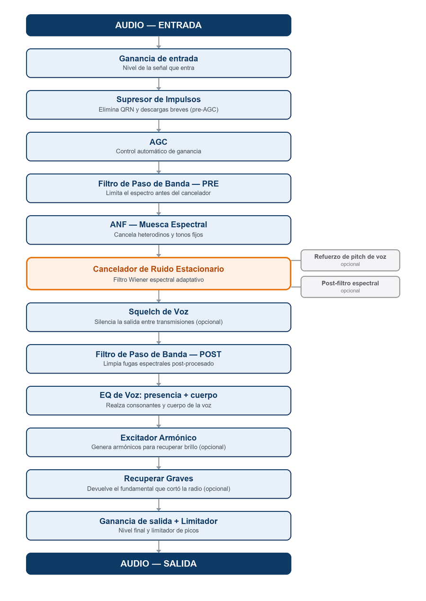

# RadioNoiseKiller — Manual de Usuario

**Versión 2.3**

---

## Introducción

**RadioNoiseKiller** es una aplicación para Windows y Linux que procesa en tiempo real el audio de una radio AM/SSB antes de que llegue a los parlantes o auriculares. Se ubica entre la salida de audio de la radio (o receptor SDR) y la reproducción final, actuando como una cadena de filtros digitales diseñados específicamente para el tipo de ruido que aparece en las bandas de onda corta y AM.

### ¿Para qué sirve?

En radioafición y escucha de onda corta, el audio suele estar degradado por:

- **Ruido de banda** (estático, ruido blanco de fondo)
- **Impulsos atmosféricos** (QRN, descargas eléctricas, frituras)
- **Interferencias de tonos** (heterodinos, portadoras AM de otras estaciones, armónicos de red)
- **Ancho de banda excesivo** (frecuencias fuera de la voz que agregan ruido innecesario)

La aplicación aplica una serie de procesos en cadena — el **pipeline** — donde cada etapa ataca un tipo de degradación específico. El resultado es audio más limpio, con mayor inteligibilidad de voz, sin introducir artefactos artificiales audibles.

### ¿Cómo se usa en la práctica?

1. Conectar la salida de audio de la radio a una entrada de la PC (línea in, o virtual cable si es SDR por software).
2. Seleccionar esa entrada como **dispositivo de entrada** en la aplicación.
3. Seleccionar los parlantes o auriculares como **dispositivo de salida**.
4. Configurar el modo (AM o SSB) y pulsar **ACTIVAR**.
5. Ajustar los módulos según el tipo de señal y condiciones de propagación.

### Lo que la aplicación NO hace

- No demodula la señal de RF — recibe audio ya demodulado.
- No corrige el nivel de los desvanecimientos (fading) de propagación — para eso está el **Nivelador de voz** (Cap. 7), que empareja el nivel entre subidas y bajadas.
- No mejora señales con nivel de señal (S-meter) muy bajo — necesita algo de señal para trabajar.

### Ayuda dentro de la aplicación

**Todos los sliders tienen un texto de ayuda**: dejá el mouse un segundo sobre el nombre, la barra
o el valor del control y aparece un cartel con qué hace, hacia dónde moverlo y qué se paga a cambio.
Es la versión corta de lo que explican los capítulos que siguen — sirve para ajustar sin soltar la
radio, y el manual queda para cuando querés el porqué.

También podés hacer **click derecho sobre cualquier slider** para restaurar su valor de fábrica.

---

## Glosario de términos

Los términos que aparecen a lo largo del manual, en orden alfabético. Los operadores con experiencia pueden saltear este capítulo y volver cuando encuentren un término desconocido.

| Término | Significado |
|---------|-------------|
| **AGC** | Control Automático de Ganancia (*Automatic Gain Control*). Ajusta el volumen de forma continua para mantener un nivel de salida estable: amplifica las señales débiles y atenúa las fuertes. |
| **AM / SSB** | Los dos modos de recepción soportados. **AM** (amplitud modulada): radiodifusión y onda corta comercial, ancho de banda amplio. **SSB** (banda lateral única): el modo de voz habitual en radioafición de HF, más eficiente pero con la voz comprimida en frecuencia. |
| **ANF** | Filtro de muesca automático (*Automatic Notch Filter*). Detecta y elimina tonos continuos (heterodinos, portadoras, zumbidos de red) sin afectar la voz. |
| **Armónicos** | Múltiplos de la frecuencia fundamental de un sonido. La voz humana concentra su energía en la fundamental (80–400 Hz) y sus armónicos — esa estructura es lo que distingue la voz del ruido. |
| **Ataque / Release** | Tiempos de reacción de un procesador de dinámica. **Ataque:** cuán rápido reacciona cuando la señal sube. **Release:** cuán rápido se recupera cuando la señal baja. |
| **Bin (espectral)** | Cada una de las "celdas" de frecuencia en que la FFT divide el espectro. El cancelador de ruido decide bin por bin cuánto atenuar. |
| **Bypass** | Pasar el audio sin procesar. Sirve para comparar el sonido con y sin la aplicación. |
| **dB / dBFS** | **Decibel:** unidad logarítmica de nivel; +6 dB ≈ el doble de amplitud, −20 dB = una décima parte. **dBFS** (*full scale*): decibeles referidos al máximo digital; 0 dBFS es el tope absoluto antes de la distorsión, los niveles de trabajo son negativos (ej. −20 dBFS). |
| **DSP** | Procesamiento Digital de Señales (*Digital Signal Processing*). Todo el trabajo que la aplicación hace sobre el audio: filtros, cancelación de ruido, ecualización. |
| **Fading / QSB** | Desvanecimiento: subidas y bajadas lentas del nivel de señal por cambios en la propagación ionosférica, típico de onda corta. QSB es su código Q en radioafición. |
| **FFT / Espectro** | La FFT (*Fast Fourier Transform*) descompone el audio en sus frecuencias componentes. El **espectro** es esa representación: cuánta energía hay en cada frecuencia. |
| **Filtro de paso de banda** | Filtro que deja pasar solo las frecuencias entre un límite inferior y uno superior (ej. 200–3000 Hz para SSB), eliminando todo lo demás. |
| **Gate** | Compuerta de audio: abierta deja pasar el sonido, cerrada lo atenúa. Es el mecanismo del Gate de ruido (Cap. 8). |
| **Heterodino** | Tono continuo (silbido) producido por una portadora cercana a la frecuencia sintonizada. El ANF los elimina automáticamente. |
| **Hz / kHz** | Hertz: unidad de frecuencia (ciclos por segundo). 1 kHz = 1000 Hz. La voz en SSB ocupa aproximadamente 200–3000 Hz. |
| **MCRA** | Modo de estimación **Adaptativa** del ruido (*Minima Controlled Recursive Averaging*). Estima el piso de ruido de forma continua y automática, sin necesidad de "aprender" un perfil manualmente. Alternativa al Perfil estático. |
| **Perfil de ruido** | "Fotografía" del ruido de la banda que el cancelador usa como referencia. En modo estático se aprende manualmente (3–5 s sin señal); en modo Adaptativo (MCRA) se estima solo. |
| **Pipeline** | La cadena de procesamiento: la secuencia ordenada de etapas que el audio atraviesa desde la entrada hasta la salida. |
| **Piso de ruido** | El nivel de ruido de fondo constante de la banda. Todo lo que está por debajo es inaudible; la señal útil debe superarlo. |
| **Pitch (f0)** | La frecuencia fundamental de la voz — el "tono" con que habla una persona (80–400 Hz). La aplicación lo detecta para proteger los armónicos de la voz. |
| **Portadora** | Señal de radio sin modulación (un tono puro en RF). En el audio demodulado aparece como silbido continuo o como silencio con ruido de fondo, según el modo. |
| **Preset** | Conjunto guardado de todos los ajustes DSP y de ganancia, para cargar de una vez configuraciones completas (pestaña Presets). |
| **Q (selectividad)** | Factor de calidad de un filtro: qué tan angosto es. Q bajo = afecta una banda ancha de frecuencias; Q alto = pico angosto y selectivo. |
| **QRN** | Código Q para el ruido atmosférico: descargas eléctricas, tormentas, crujidos impulsivos. Lo ataca el Supresor de Impulsos. |
| **Retención (hold)** | Tiempo que el gate sigue abierto después de que la señal cae, para no cortar finales de palabra ni pausas breves. |
| **RMS** | Valor eficaz (*Root Mean Square*): medida del nivel promedio de una señal, más representativa del volumen percibido que el valor pico. |
| **SDR** | Radio Definida por Software (*Software Defined Radio*). Receptores cuya demodulación se hace en la PC (SDR#, HDSDR, etc.); su audio se puede procesar con esta aplicación usando un cable de audio virtual. |
| **SNR** | Relación señal/ruido (*Signal-to-Noise Ratio*): cuántas veces la señal supera al ruido. SNR alto = señal limpia; SNR bajo = señal enterrada en ruido. |
| **Squelch** | Silenciador del receptor: corta la salida de audio cuando no hay una transmisión presente. En esta aplicación el equivalente es el **Gate de ruido** (Cap. 8), que atenúa en vez de cortar y decide por nivel de entrada. |
| **Umbral** | Valor de disparo de un detector: por encima de él actúa, por debajo no. Varios módulos tienen umbral configurable (gate de ruido, ANF, supresor de impulsos). |
| **VAD** | Detector de Actividad de Voz (*Voice Activity Detector*). Decide en tiempo real si lo que se escucha es voz humana o solo ruido; alimenta al cancelador. |
| **Wiener (filtro)** | Técnica matemática de reducción de ruido que atenúa cada bin del espectro en proporción a cuánto ruido contiene. Es el corazón del Cancelador de Ruido Estacionario. |

---

## Diagrama del Pipeline

El audio recorre los siguientes procesos en orden. Cada etapa puede activarse o desactivarse de forma independiente:

---

## Capítulo 1 — Dispositivos de Audio

**Ubicación:** Pestaña Principal → grupo "Dispositivos de Audio"

### Descripción

Selecciona de dónde viene el audio (entrada) y a dónde va (salida). La aplicación solo muestra dispositivos **WASAPI** y **WDM-KS**, que son los drivers de Windows con menor latencia.

### Controles

| Control | Descripción |
|---------|-------------|
| **Entrada** | Fuente de audio. Puede ser una entrada física (línea in, micrófono), una tarjeta de audio virtual (VB-Cable, etc.) o "Mezcla estéreo" para capturar lo que reproduce otra aplicación. |
| **Salida** | Destino del audio procesado. Típicamente los parlantes o auriculares. |
| **⟳ (refrescar)** | Vuelve a buscar los dispositivos de audio sin cerrar la aplicación — para cuando se conecta o desconecta hardware (interfaz USB, auriculares) con el programa ya abierto. La selección actual se conserva si el dispositivo sigue presente. Solo disponible con el procesamiento detenido. |
| **Canal** | Canal tomado de la entrada cuando es estéreo: **Izquierdo** (default), **Derecho** o **Mezcla L+R**. Se aplica en vivo, sin reiniciar el procesamiento. Con entradas mono no tiene efecto. |

### Consejos

- Si usás un SDR por software (HDSDR, SDR#, etc.), configurá en ese programa la salida hacia un **cable de audio virtual** y seleccioná ese cable como entrada aquí.
- Si la lista aparece vacía o incompleta, o se conectó hardware nuevo con el programa abierto, usar el botón **⟳** para re-enumerar los dispositivos (con el procesamiento detenido). Si aún así falta un dispositivo, reiniciar la aplicación.
- El cambio de dispositivo requiere detener y volver a activar el procesamiento — por eso los selectores de Entrada/Salida se deshabilitan mientras el procesamiento está activo (el de Canal queda habilitado: aplica en vivo).
- Si no se escucha nada con una interfaz USB estéreo, probar **Canal: Derecho** — es común que el audio de la radio venga cableado por ese canal.
- La entrada y la salida deben ser de la **misma API de Windows** (ambas WASAPI, o ambas WDM-KS): un stream full-duplex no admite cruzar APIs. Si elegís una combinación incompatible (por ejemplo entrada WASAPI + una salida que solo existe en WDM-KS, como "Mezcla estéreo"), la aplicación **deshabilita el botón ACTIVAR**, marca ambos selectores con un borde de aviso y explica el motivo en la barra de estado. Elegí ambos dispositivos de la misma API para poder activar.
- En radios con **doble receptor** (RX principal por el canal izquierdo, sub-RX por el derecho), el selector de Canal permite elegir cuál procesar. La salida procesada suena siempre en ambos oídos.

---

## Capítulo 2 — Control General

**Ubicación:** Pestaña Principal → grupo "Control"

### Descripción

Controles principales de operación: modo de recepción, AGC y activación del procesamiento.

### Controles

| Control | Descripción |
|---------|-------------|
| **Pasabanda** | Ancho del filtro de entrada, elegido por lo que se está escuchando. Hay ocho anchos listos —cuatro de fonía SSB y cuatro de AM— más **Personalizado**, que son los límites que se ajusten a mano en *Avanzada Audio*. Reemplaza al viejo selector **Modo (AM/SSB)**: con los presets de la app, elegir el modo y después el ancho era decir dos veces lo mismo — lo que se elige es el **ancho**. |
| **AGC** | Control Automático de Ganancia. **off** = sin AGC. **slow / medium / fast** = velocidad de respuesta (ataque/release fijos por preset). Para SSB se recomienda *slow* o *medium*; para AM con señales estables, *off* o *slow*. |
| **Nivelar en continuo (música)** | Casilla del **Nivelador de voz** (Cap. 7), puesta acá porque se cambia según lo que se esté escuchando: marcada para música o audio continuo, sin marcar para voz. Requiere el cancelador y el nivelador activos. |
| **Techo de ruido** | Limita cuánto puede amplificar el AGC, para que no levante el ruido de banda. Ver más abajo. |
| **▶ ACTIVAR / ■ DETENER** | Inicia o detiene el procesamiento en tiempo real. Al activar, el audio fluye por todo el pipeline. |

### AGC — techo de ruido

**Ubicación:** Pestaña Principal → grupo "Control", debajo del selector de AGC

El AGC lleva la señal a su nivel objetivo **sin distinguir voz de ruido**. Con una estación fuerte eso es exactamente lo que uno quiere; con una señal débil, lo que mide es casi todo ruido de banda, y lo amplifica hasta **+36 dB**. El resultado es el siseo molesto que aparece cuando la estación deja de transmitir: medido, el AGC llega a su tope y el ruido queda 24 dB más arriba de lo necesario.

Con esta opción, la ganancia del AGC se topea para que **el ruido de fondo no supere el nivel que elijas**. El AGC sigue adaptando normalmente — no se congela — y la voz la termina de levantar el **Nivelador de voz**, que sí distingue voz de ruido porque actúa después del cancelador.

| Control | Rango | Default | Descripción |
|---------|-------|---------|-------------|
| **El ruido no pasa de** | −70 a −25 dBFS | −45 dBFS | Nivel máximo que se le permite al ruido de fondo. Más bajo = fondo más silencioso. |

**Indicador "Tope aplicado":** muestra el **piso de ruido medido en tu entrada** y si el tope está actuando. Es el dato que hace entendible el control, porque el tope vale `techo − piso`:

- *"piso −38 dBFS · sin efecto"* — el tope existe pero el AGC no lo alcanza. **Es lo normal con señal fuerte**: el AGC no quiere amplificar, así que no hay nada que limitar. El techo va a entrar en acción recién cuando la señal se debilite.
- *"piso −38 dBFS · limitando a +7 dB"* — el tope está mordiendo: el AGC querría amplificar más y no lo dejamos. Es el modo de trabajo esperado con señal débil.

Usá el piso que muestra para elegir el umbral: **ponelo por encima de ese valor**. Si lo ponés por debajo, el tope da 0 dB de ganancia permitida y el control deja de tener sentido.

> **Es un ajuste personal de cada estación, y por eso viene desactivado.** El techo es un nivel **absoluto** en dBFS, pero el piso de ruido no es un número universal: depende de tu QTH, de la antena, de la banda y hasta de la hora. Un valor que en una estación deja el fondo perfecto, en otra queda por debajo del piso real y **limita más de lo que ayuda** — la voz débil se ahoga en vez de mejorar. Por eso los presets de fábrica lo traen **apagado** y no llevan un valor recomendado: es de las pocas cosas de esta aplicación que hay que calibrar **en tu propia estación, escuchando**, y volver a mirar si cambiás de banda o de antena. Si no notás el siseo que describe el párrafo de arriba, dejalo apagado sin culpa.

> **Por qué el tope no se abre de golpe (cambió post-v2.2):** durante un desvanecimiento baja todo —señal y ruido— así que el piso medido se desploma y el tope se abriría de par en par, dejando al AGC amplificar mucho. Cuando la señal vuelve de golpe, esa ganancia acumulada sale como un **subidón**. Para evitarlo, el tope **aprieta al instante** si el ruido sube, pero se **afloja despacio** (0,5 dB por segundo). Medido con un fade de 20 dB que vuelve en 0,3 s, el salto al volver pasa de +8,9 a +4,0 dB — mejor incluso que tener el techo desactivado. Lo único que se paga es que, si el ruido baja de verdad (se apaga una fuente de QRM), el tope tarda unos segundos en dejarte aprovechar la banda más limpia; en el ínterin sólo amplifica un poco menos.

> **Por qué es un tope y no un "congelar el AGC cuando no hay voz":** esa alternativa parece más directa pero se traba. El detector de voz trabaja sobre la señal ya amplificada por el AGC; si se congela la ganancia en un valor bajo, el detector deja de dispararse, el congelamiento no se libera nunca y la voz que vuelve queda muy por debajo (medido: 21 dB). Un tope, en cambio, deja al AGC adaptando siempre, así que no puede quedar atrapado.

### Idioma de la interfaz

El selector de idioma (🌐 Español / English) está en la **esquina derecha de la barra de estado** (borde inferior de la ventana), visible desde cualquier pestaña. El cambio se guarda al instante pero **requiere reiniciar la aplicación** para aplicarse.

### Tamaño de la interfaz

Si en tu monitor los textos quedan chicos, el combo **🔍 100 % / 125 % / 150 %** —al lado del selector de idioma, en la barra de estado— agranda **toda la interfaz a la vez**: letras, sliders, VU, espectro y botones, manteniendo el diseño exacto. No toca el audio ni el procesamiento. Igual que el idioma, se guarda al instante y **requiere reiniciar la aplicación**.

Por defecto viene en **100 %**, que es el tamaño de siempre — quien no lo necesite no ve ningún cambio.

> **Sobre las opciones que aparecen:** la ventana tiene ancho fijo, así que a mayor escala ocupa más pantalla (150 % ≈ 1155 px de ancho). El combo ofrece sólo las escalas que **entran en tu monitor**: en una pantalla chica el 150 % directamente no aparece. Si cambiás de monitor a uno más chico y la escala guardada ya no entra, la aplicación vuelve sola a 100 % y avisa en la barra de estado.

> **Alternativa del sistema:** Windows (*Configuración → Pantalla → Escala*) y GNOME tienen su propio escalado, que la aplicación respeta. La diferencia es que el del sistema afecta a **todos** los programas; este control es sólo para RadioNoiseKiller.

### Acerca de — y cómo apoyar el proyecto

El botón **ℹ**, también en la barra de estado, abre el cuadro *Acerca de*: versión, identificador de compilación (útil si reportás algo), autor y el enlace al repositorio en GitHub.

Ahí mismo hay un botón **☕ Invitame un café**, que abre en el navegador la página de donaciones del proyecto:

**https://cafecito.app/gpagliaroli**

RadioNoiseKiller es gratuito y de código abierto (licencia MIT), y va a seguir siéndolo — la donación es **completamente opcional** y no habilita ninguna función. Si te resultó útil en el aire y querés bancar el desarrollo, es la forma de hacerlo.

> **Si estás fuera de Argentina:** Cafecito es una plataforma argentina, pero acepta tarjetas internacionales. La donación entra igual desde donde estés.

### Presets de AGC

El combo **AGC** de la pestaña Principal ofrece tres velocidades con ataque/release fijos, todos con objetivo −20 dBFS y ganancia máxima +36 dB:

| Preset | Ataque | Release | Uso típico |
|--------|--------|---------|------------|
| **fast**   | 5 ms   | 500 ms  | Protege de picos bruscos; puede "bombear" con voz SSB. |
| **medium** | 25 ms  | 2000 ms | Equilibrado — buen punto de partida general. |
| **slow**   | 100 ms | 5000 ms | Estable con QSB profundo; el más natural para voz. |

Con **off** el AGC queda fuera del pipeline. Para SSB se recomienda *slow* o *medium*; para AM con señales estables, *off* o *slow*.

---

## Capítulo 3 — Módulos Activos

**Ubicación:** Pestaña **Módulos**

> **Novedad v1.7:** los "Módulos activos" pasaron de la pestaña Principal a una **pestaña propia
> ("Módulos", segunda en la fila)**, para dejar la pestaña Principal más despejada. Los controles y
> su comportamiento son idénticos; solo cambió de lugar.

### Descripción

Cada casilla de verificación activa o desactiva un módulo del pipeline de forma independiente y en tiempo real. El audio sigue fluyendo — simplemente el módulo es bypaseado cuando está desactivado.

### Módulos disponibles

| Módulo | Cuándo activarlo |
|--------|-----------------|
| **Supresor de impulsos** | Siempre en bandas con QRN (tormentas, ruido industrial). Desactivar si la señal es limpia para ahorrar CPU. |
| **Filtro de paso de banda (pre)** | Casi siempre activo. Limita el espectro antes del cancelador. |
| **ANF — Cancela heterodinos y tonos** | Activar cuando se escuchen tonos constantes (pito, zumbido). Desactivar con señales de datos/digitales (PSK, FT8) ya que los tomaría por interferencia. |
| **Cancelador de ruido estacionario** | El módulo principal. Activar una vez aprendido el perfil de ruido. |
| &nbsp;&nbsp;&nbsp;↳ **Piso espectral perceptual** | Sub-módulo del cancelador. Reemplaza el piso fijo por una curva que varía con la frecuencia: eleva el piso en la zona vocal (~500 Hz, preserva la calidez de la voz) y lo baja en alta frecuencia (suprime más el soplido). Curva configurable en Avanzada Cancelador. |
| &nbsp;&nbsp;&nbsp;↳ **Post-filtro espectral** | Sub-módulo del cancelador. Elimina el "ruido musical" (pitidos intermitentes) que el Wiener deja como residuo. Activar cuando se note ese artefacto. Agresividad configurable en Avanzada Cancelador. |
| &nbsp;&nbsp;&nbsp;↳ **Refuerzo de pitch de voz** | Sub-módulo del cancelador. Para señales de voz muy débiles (AM o SSB): detecta el tono fundamental de la voz y protege sus armónicos de ser suprimidos — mejora la inteligibilidad. Activar si la voz suena "fantasmal" con el cancelador al máximo. Sensibilidad configurable en Avanzada Cancelador. |
| &nbsp;&nbsp;&nbsp;↳ **Nivelador de voz** | Sub-módulo del cancelador. AGC de voz aplicado *después* de la reducción de ruido: mantiene la voz limpia a nivel constante aunque las condiciones de la banda (y la cantidad de cancelación) varíen. Solo adapta cuando detecta voz — el ruido entre transmisiones no se re-amplifica. |
| **Filtro de paso de banda (post)** | Casi siempre activo junto con el pre. Limpia artefactos del procesamiento espectral. Corre después del cancelador (el orden de esta lista refleja el pipeline). Sus límites pueden independizarse de la entrada (ver Cap. 5). |
| **EQ Voz (presencia + cuerpo)** | Dos bandas paramétricas: presencia (claridad, 1–2 kHz) y cuerpo (calidez, 150–800 Hz). Activar para modelar la voz con señales debilitadas o muy filtradas. |
| **Excitador armónico** | Para señales de voz opacas, sin brillo. Añade presencia. Comparar con y sin para decidir. |
| **Recuperar graves** | Devuelve el fundamental de la voz cuando el filtro de la radio lo cortó, derivándolo de los armónicos que sí pasaron. Para voces que suenan delgadas o "telefónicas" pese a tener buen nivel — sobre todo en SSB con filtro angosto. |
| **Gate de ruido** | Módulo de primer nivel (no depende del cancelador). Baja el fondo entre transmisiones cuando el nivel de entrada no llega al umbral, con cierre progresivo y sin cortar de golpe. Corre al final de la cadena. Se calibra mirando el indicador de nivel en Avanzada Cancelador (ver Cap. 8). |

> **Consejo — activar de a uno:** al armar una configuración (o al recibir una señal nueva), activar y desactivar los módulos **de a uno por vez**, escuchando el efecto que produce cada uno. Como todos los cambios aplican en vivo, se oye la diferencia al instante: eso permite ajustar mejor cada módulo — o directamente quitarlo si en esa señal no aporta. Activar todo junto de entrada hace imposible saber qué está ayudando y qué no.

---

## Capítulo 4 — Supresor de Impulsos

**Ubicación:** Pestaña Avanzada Impulsos → grupo "Supresor de impulsos"

### Descripción

Detecta y atenúa transientes cortos de alta energía: descargas atmosféricas (QRN), líneas de alta tensión, motores eléctricos y cualquier interferencia impulsiva. Opera **antes** del AGC y el cancelador de ruido, con dos niveles de detección en cascada.

- **Nivel 1 (trama de 10 ms):** detecta bursts de energía que duran varios milisegundos, típicos de descargas atmosféricas grandes.
- **Nivel 2 (micro-trama de 0,67 ms):** detecta impulsos muy cortos — frituras, crackles, encendido de dispositivos cercanos.

El indicador **Actividad** muestra en tiempo real cuántos impulsos por segundo está detectando (⚡ N /s).

> **Qué significan los umbrales (cambió en la v2.2).** Los dos números son un **contraste contra los vecinos inmediatos**, no contra el piso de ruido: "15×" quiere decir *quince veces más fuerte que el audio de al lado*. Es el mismo principio que usa el ANF, pero en el tiempo en vez de en la frecuencia. La razón es que la voz es **sostenida** — sus vecinos están igual de fuertes, así que el cociente da ~1 y el detector no dispara. Un impulso, en cambio, es un trozo aislado rodeado de nada, y salta a la vista. Hasta la v2.1 la comparación era contra el piso de ruido, lo que hacía que con una señal 20 dB sobre el piso **toda sílaba cruzara el umbral**: el módulo no suprimía impulsos, comprimía la voz. Si venías con el supresor apagado por ese motivo, se puede volver a activar.

### Controles

| Control | Rango | Default | Descripción |
|---------|-------|---------|-------------|
| **Umbral de trama (10 ms)** | 5× – 100× | 15× | Sensibilidad del detector de trama larga. Valor bajo = más agresivo (captura más impulsos pero puede afectar la voz). Valor alto = solo blanquea pulsos muy intensos. **Bajar** si quedan descargas audibles; **subir** si la voz suena recortada. |
| **Umbral micro (0,67 ms)** | 3× – 30× | 8× | Sensibilidad para frituras y crackles muy cortos. Funciona igual que el anterior pero a escala de microsegundos. |

### Valores recomendados por situación

| Situación | Umbral trama | Umbral micro |
|-----------|-------------|--------------|
| Banda limpia, sin QRN | 50× | 20× |
| QRN moderado | 15× | 8× |
| Tormenta eléctrica cercana | 8× | 5× |

---

## Capítulo 5 — Filtro de Paso de Banda

**Ubicación:** Pestaña Avanzada Audio → grupo "Filtro de paso de banda"

### Descripción

Filtro Butterworth IIR que limita el ancho de banda del audio a las frecuencias útiles para la voz. Se aplica en **dos puntos** del pipeline:

- **Pre (antes del cancelador):** limita el espectro que el cancelador "aprende" como ruido. Evita que el cancelador intente suprimir energía fuera del rango vocal.
- **Post (después del cancelador):** elimina artefactos espectrales que el procesamiento STFT del cancelador puede introducir fuera de la banda útil.

Ambos se activan/desactivan de forma independiente desde **Módulos Activos**.

### Controles

| Control | Rango | Default | Descripción |
|---------|-------|---------|-------------|
| **Entrada – Hz inferior** | 50–1000 Hz | 200 Hz | Corte inferior. Subirlo saca retumbe, zumbido de red y ruido de motor; bajarlo deja más cuerpo en la voz. |
| **Entrada – Hz superior** | 1000–10000 Hz | 3000 Hz | Corte superior. Bajarlo saca siseo y QRM del canal de al lado; subirlo deja más brillo y consonantes. Hasta 10 kHz para emisoras de AM local con buen audio. |
| **Orden del filtro** | 2 / 4 / 6 / 8 | 4 | Pendiente del filtro. Mayor orden = corte más abrupto = mejor rechazo fuera de banda, pero mayor latencia de fase. Para uso normal, orden 4 es adecuado. |

> **Estos sliders y el combo Pasabanda son el mismo ajuste visto de dos maneras.** Elegir un ancho en
> el combo mueve los sliders; mover un slider pone el combo en **Personalizado**. Nunca muestran
> cosas distintas, así que el combo siempre dice lo que de verdad está sonando.
>
> **Anchos disponibles en el combo:**
>
> | Ancho | Corte inferior | Corte superior |
> |---|---|---|
> | SSB muy angosto | 400 Hz | 2100 Hz |
> | SSB angosto | 300 Hz | 2400 Hz |
> | SSB normal | 200 Hz | 2700 Hz |
> | SSB ancho | 200 Hz | 3000 Hz |
> | AM 3 kHz | 200 Hz | 3000 Hz |
> | AM 4 kHz | 150 Hz | 4000 Hz |
> | AM 6 kHz | 100 Hz | 6000 Hz |
> | AM 8 kHz | 100 Hz | 8000 Hz |
>
> *SSB ancho* y *AM 3 kHz* son los mismos hercios con dos nombres: la etiqueta está para elegir por
> lo que uno escucha, no para que haya que traducir mentalmente. Y ojo con los anchos grandes: no
> sirven de nada si el receptor no entrega señal ahí arriba — se ve mirando hasta dónde llega la
> curva de **Entrada** en la pestaña Espectro (ver el Cap. del espectro).

### Salida independiente de la entrada

Por defecto, el filtro de salida usa **los mismos límites** que el de entrada. La casilla **"Salida independiente de la entrada"** habilita dos sliders propios (*Salida – Hz inferior/superior*) para desacoplarlos. La salida no tiene combo: es un retoque fino sobre el ancho que ya se eligió, y casi siempre se define en relación a la entrada (más ancha).

¿Para qué? Dos filtros iguales en cascada duplican la atenuación en el borde de banda: la parte alta de la voz llega **doblemente apagada**. Con salida independiente se puede usar:

- **Entrada angosta** (p. ej. SSB hasta 2700 Hz): menos soplido entra al cancelador de ruido.
- **Salida más ancha** (3500–4000 Hz): la voz conserva su borde superior natural y el brillo que regenera el Excitador armónico pasa completo. El filtro de salida sigue limpiando artefactos por encima de su propio corte.

Regla práctica: la salida **igual o más ancha** que la entrada. Más angosta que la entrada re-recorta señal útil sin beneficio.

### Consejos

- Para **AM locales con buena música** o audio de calidad: subir el Hz superior hasta 7000–10000 Hz.
- Para **SSB DX** con mucho ruido: bajar el Hz inferior a 300–400 Hz y el superior a 2500 Hz para reducir el ruido de banda.
- Cambiar el orden del filtro requiere reiniciar el procesamiento (el botón se deshabilita mientras está activo).

### Splatter de una estación vecina

El **splatter** son los productos de intermodulación de un transmisor sobreexcitado, que se derraman
sobre las frecuencias de al lado. En tu audio llegan como sílabas del vecino, con su propia envolvente
de habla.

**El cancelador de ruido no lo va a quitar, y no es un defecto:** el cancelador está construido sobre
la premisa de que el ruido es estacionario, y estima el piso buscando mínimos. Algo que sube y baja
con las sílabas de otra persona nunca entra en ese mínimo. Subir la Intensidad no ataca al splatter —
sólo te come tu propia voz. El ANF tampoco sirve: es para tonos, y el splatter es de banda ancha.

**Lo que sí funciona es el pasabanda, angostando del lado por el que entra:**

1. Fijate de qué lado está el vecino. Si está *arriba* en frecuencia, bajá el **Hz superior**; si está
   *abajo*, subí el **Hz inferior**. Angostar de los dos lados por las dudas es tirar señal.
2. Subí el **orden del filtro** a 6 u 8. Eso empina el corte y es lo que más rinde: gana rechazo del
   vecino sin sacrificar ancho de banda propio.
3. Si usás **Salida independiente**, angostá la ENTRADA (le llega menos basura al cancelador) y dejá
   la salida más ancha.

> **No te pases de angosto.** La discriminación de las consonantes (/s/, /f/, /t/) vive entre 2 y
> 4 kHz. Por debajo de **2,4 kHz** empezás a perder inteligibilidad, y ahí el remedio es peor que la
> enfermedad: se entiende menos aunque se escuche más limpio. Es preferible tolerar algo de splatter
> y conservar el ancho de banda.

**Por qué no se puede filtrar todo:** en SSB la demodulación traslada el espectro del vecino según la
diferencia de frecuencia entre ustedes. Su sibilancia, que en su transmisor está en 4–7 kHz, puede
aterrizar en 800 Hz o en 2 kHz dentro de *tu* banda. Esa parte queda **co-canal**, mezclada con tu
voz en las mismas frecuencias, y no la saca ningún filtro. El pasabanda recorta lo que quedó afuera;
lo que entró, entró.

> **El arreglo de verdad está en la radio, no acá:** un filtro de FI más angosto, el *IF shift*
> corrido hacia el lado opuesto al vecino, o bajar el RF gain si el splatter te está bombeando el AGC
> del receptor.

---

## Capítulo 6 — ANF: Filtro de Muesca Espectral

**Ubicación:** Pestaña Avanzada Impulsos → grupo "ANF — Cancela heterodinos y tonos interferentes"

### Descripción

El **ANF** (Adaptive Notch Filter) detecta automáticamente tonos fijos o casi fijos en el espectro — heterodinos, portadoras AM de estaciones adyacentes, zumbidos de red (50/60 Hz y sus armónicos) — y los atenúa sin afectar el audio de voz circundante.

El algoritmo compara la magnitud de cada bin FFT con la mediana de sus vecinos. Si un bin supera N veces el nivel del entorno, se considera un tono y se aplica una muesca (notch). No tiene estado entre frames, lo que lo hace muy reactivo pero también evita que "persiga" voces.

El indicador **Actividad** muestra cuántos tonos están siendo muescados en este momento.

> **Importante:** No usar ANF con señales digitales (FT8, PSK31, WSPR, etc.). Esas señales tienen estructura espectral que el ANF interpreta como tonos a eliminar.

### Controles

| Control | Rango | Default | Descripción |
|---------|-------|---------|-------------|
| **Sensibilidad** | 1,5× – 10× | 3,0× | Ratio mínimo bin/entorno para considerar un tono. **Bajar** (1,5–2,5×) para detectar tonos débiles que apenas sobresalen. **Subir** (5–10×) para ser más selectivo y solo eliminar interferencias muy fuertes. |
| **Profundidad** | 0% – 100% | 50% | Cuánto se atenúa el tono detectado. 100% = silencia completamente el bin. 50% = reduce 6 dB. Hasta la v2.1 los valores altos opacaban la voz, pero **la causa era que el ANF tomaba armónicos de la voz por tonos**; con la detección por persistencia eso ya no pasa (medido: 0 % de falsos positivos y 0,0 dB de pérdida sobre voz sin heterodinos). El default sigue en 50 %, pero **ahora se puede subir a 90–100 % sin que se apague la voz** — si venías conteniéndote por ese motivo, reajustalo escuchando. |

---

## Capítulo 7 — Cancelador de Ruido Estacionario

**Ubicación:** Pestaña Principal → grupo "Cancelación de Ruido Estacionario" y Pestaña Avanzada Cancelador → grupo "Cancelador de ruido estacionario"

### Descripción

Es el módulo central de la aplicación. Implementa un **filtro de Wiener Log-MMSE espectral** con estimador DD (Decision-Directed) que reduce el ruido estacionario de fondo — estático de banda, ruido blanco, ruido de propagación — preservando la voz.

El estimador Log-MMSE (Ephraim & Malah, 1985) calcula la ganancia óptima bin a bin minimizando la distorsión en escala logarítmica, que se alinea con la percepción auditiva. Esto produce menos "metalicidad" residual en la voz respecto al Wiener clásico, especialmente en señales débiles.

### Modos de estimación de ruido

El cancelador ofrece dos modos, seleccionables desde el selector **Modo:** del grupo *Cancelador de ruido* en la pestaña Principal (no confundir con el combo **Pasabanda**, que elige el ancho del filtro):

**Perfil estático** (modo manual)
El algoritmo aprende una "foto" del ruido de fondo durante unos segundos y la usa como referencia fija. Ideal cuando el ruido de banda es muy estable.

1. **Buscar un hueco de solo ruido** — un momento sin señal, cuando la estación no está transmitiendo.
2. Pulsar **⏺ Aprender ruido** y esperar 3–5 segundos.
3. Pulsar **⏹ Detener** — el perfil queda guardado y se aplica.
4. Si las condiciones cambian mucho, repetir el proceso.
5. **Borrar perfil** reinicia la referencia.

> **Importante — aprender solo ruido:** conviene **correrse un poquito en frecuencia** hasta un lugar del dial **sin emisoras** (solo el ruido de fondo de la banda), aprender ahí, y recién después volver a la estación. Si durante el aprendizaje se cuela algo de **voz o una portadora**, esa energía queda "horneada" en el perfil de ruido, y el cancelador la resta después como si fuera ruido — se oyen artefactos y huecos sobre la voz real. El objetivo del perfil es una foto del **ruido puro**, no de la señal.

Durante el aprendizaje la aplicación toma dos medidas automáticas para capturar un perfil fiel:

- **El AGC se congela.** Sin esto, el AGC amplificaría progresivamente el ruido de banda hasta su nivel objetivo y el perfil capturaría un barrido de niveles en lugar de un nivel estable.
- **El monitoreo se atenúa −12 dB.** Escuchar el ruido crudo a volumen pleno durante 3–5 segundos es molesto; la atenuación es solo en lo que se escucha — el algoritmo analiza la señal a nivel completo.

Ambas medidas se liberan solas al pulsar ⏹ Detener (o al cancelar el aprendizaje).

**Perfiles de ruido con nombre** (guardar y reutilizar)

Aprender el perfil cada vez que se abre la aplicación es tedioso. Con los botones **"💾 Guardar perfil..."** y **"📁 Perfiles..."** (bajo Aprender/Borrar, solo en modo estático) se puede guardar el perfil actual con un nombre y volver a cargarlo cuando haga falta:

1. Aprender un perfil como de costumbre (o cargar uno guardado y reajustar).
2. **💾 Guardar perfil...** → escribir un nombre descriptivo ("40m casa", "20m campo", "ruido notebook").
3. En otra sesión, **📁 Perfiles...** → elegir el perfil de la lista para cargarlo al instante, sin volver a aprenderlo.

Los perfiles se guardan como archivos `.json` en la carpeta **`PerfilesRuido/`** junto al ejecutable (se pueden respaldar o copiar entre equipos). Al cargar un perfil, el cancelador pasa automáticamente a modo estático.

**Auto-recarga:** el último perfil guardado o cargado se recuerda entre sesiones — al abrir la aplicación se aplica solo (la barra de estado lo confirma), así se empieza a operar con una referencia sin re-aprender nada. Si el perfil fue aprendido con otro tamaño de bloque, se adapta automáticamente por interpolación.

**Adaptativo (MCRA)** (modo automático)
El algoritmo estima el piso de ruido continuamente en tiempo real, sin necesidad de aprendizaje manual. Se calibra en ~200ms al activar el procesamiento y se adapta automáticamente cuando cambian las condiciones de propagación, aparece QRM o varía el ruido de banda.

- No requiere intervención del usuario — funciona solo.
- Los botones Aprender/Borrar no aparecen (no aplican en este modo).
- El indicador de estado cambia de "calibrando..." a "estimando en tiempo real" una vez listo.
- **Recomendado** para sesiones largas de escucha donde las condiciones de banda varían.

**Protección contra aprender la voz**

El seguimiento de mínimos del MCRA tiene una debilidad conocida: ante **voz sostenida** —una
transmisión larga sin pausas— la ventana de mínimos termina absorbiendo la propia voz, el piso
estimado sube hasta el nivel de ella y el cancelador empieza a restar la voz que debería conservar.
Se nota como voz claramente audible en el *Preview* y como voz un poco apagada en la salida, sin
importar dónde esté la Intensidad.

Para evitarlo, los frames con voz **no alimentan** el estimador. La detección usa la **periodicidad**
de la señal (autocorrelación), no su nivel: un aumento del ruido de banda —por fuerte que sea— no
es periódico y por lo tanto no congela nada, así que el estimador sigue persiguiendo al ruido como
siempre. Una retención de 300 ms cubre los tramos sordos de la voz (las fricativas no son
periódicas). Es automático y no tiene controles.

**Memoria de piso ante squelch de portadora**

Cuando el squelch de la radio corta la portadora (silencio total entre transmisiones), el MCRA detecta automáticamente que la energía del frame cayó muy por debajo del piso de ruido estimado y **congela** todo el estado del estimador: no actualiza ni el suavizado espectral, ni el seguimiento de mínimos, ni el estimado de ruido `λ_d`. Al volver la señal, el algoritmo retoma exactamente desde el perfil memorizado — sin período de re-calibración ni ruido audible al inicio de la transmisión.

Este comportamiento es automático y no requiere ningún ajuste. Se activa cuando la señal cae más de 13 dB por debajo del piso estimado, lo que distingue un squelch real (portadora cortada) de una pausa normal entre palabras donde el ruido de banda sigue presente.

> **Nota — la "Compensación de fading HF" se eliminó en esta versión.** Estaba pensada para congelar el estimador durante el QSB, pero al medirla resultó que su detector disparaba con las **sílabas** y no con los desvanecimientos: la energía de la voz oscila unos 17 dB entre sílaba y hueco, el mismo orden que el fade que buscaba. Con un detector perfecto el módulo apenas recuperaba 2,4 dB, y sólo cuando el ruido se desvanecía junto con la señal.
>
> **Contra el QSB la herramienta es el Nivelador de voz** (Cap. 7), en particular su *Velocidad de respuesta*: bajarla de 1500 a 200 ms reduce a la mitad el vaivén de nivel que agrega el procesado. Ver el consejo del Cap. 7.

### Indicadores en tiempo real (Avanzada Cancelador)

| Indicador | Descripción |
|-----------|-------------|
| **Reducción (dB)** | Cuánto está reduciendo el ruido en este momento. Verde = reducción fuerte (>10 dB). Amarillo = reducción moderada. |
| **Voz (%)** | Probabilidad de que el frame actual contenga voz (señal suavizada usada internamente por el Wiener). |
| **Preview: escuchar ruido eliminado** (pestaña Principal, junto a *Reducción extra*) | Invierte la salida para escuchar **todo lo que el cancelador está restando** — refleja la reducción **completa: Intensidad + Post-Filtro** (más el piso perceptual). Mientras está activo se saltean el **gate de ruido, el nivelador de voz, la EQ de presencia/cuerpo y el excitador**: son etapas que colorean y que se disparan justo cuando hay voz, así que falsearían el diagnóstico (un resto de voz apenas audible saldría nivelado, realzado en 1,5 kHz y con armónicos nuevos). Se conservan el pasabanda de salida —define la banda que estás escuchando— y el limitador. Útil para verificar que no se esté eliminando voz: si en el preview se escucha voz, algo está de más. |

### Controles avanzados (Pestaña Avanzada Cancelador)

| Control | Rango | Default | Descripción |
|---------|-------|---------|-------------|
| **Intensidad** | 0% – 100% | 70% | Cuánta reducción se aplica sobre los gains calculados. **0%** = sin reducción (audio pasa sin cambios). **100%** = reducción plena. La escala es no lineal: valores medios (50–70%) ya producen una reducción perceptible, mientras que los bins de voz se ven mínimamente afectados en cualquier posición. Comenzar en 70% y subir según el nivel de ruido. |
| **Piso espectral** | 0,05 – 0,30 | 0,15 | Ganancia mínima que se aplica a cualquier bin, incluso el más ruidoso. 0,10 significa que nunca se silencia más del 90% de la energía de un bin. **Nunca bajar de 0,05** — valores muy bajos con Anti-gorgojeo alto producen gorgojeo severo. |
| **Anti-gorgojeo (β)** | 90% – 99% (pasos de 0,1%) | 96% | Dosifica dos mecanismos contra el ruido musical de fondo: el *release* del cancelador y, sobre todo, el **suavizado de la clasificación voz/ruido por bin** (evita que un bin que parpadea alrededor del umbral haga saltar su ganancia — la causa principal del "gorgojeo" de fondo persistente). **Zona útil 96–98%, muy dependiente de las condiciones.** Subir si se escucha gorgojeo o pitidos de fondo; bajar (90–95%) si la voz queda con una "cola" de ruido o suena poco reactiva. El extremo (99%) da el máximo anti-gorgojeo pero deja la cola más larga tras cada transmisión. |
| **Velocidad de ataque** | 50% – 92% | 80% | Velocidad con que el cancelador "abre" los bins de voz cuando detecta una señal. Rápido (50–70%): consonantes más nítidas. Suave (>85%): menos artefactos en transiciones. |
| **Reactividad del piso** *(solo Adaptativo)* | 250 – 800 ms | 800 ms | Ventana con que el estimador MCRA sigue el mínimo del ruido. **Reactivo (250–350 ms):** el piso sigue rápido las subidas y bajadas cíclicas del ruido, sin quedar desfasado (menos "vaivén" del sonido). **Estable (800 ms):** mejor para ruido parejo. Bajarlo cuando el ruido de banda sube y baja de golpe y en ciclos cortos. Con valores muy reactivos conviene tener activo el **Refuerzo de pitch de voz** (protege los armónicos de que una ventana corta los tome por ruido). |
| **Freno de bajada** *(solo Adaptativo)* | 2 – 30 dB/s | 30 (sin freno) | Limita cuán rápido puede **bajar** el piso estimado; subir siempre es libre. Cuando el ruido de banda sube de golpe, la salida salta porque el piso llegó tarde — si el piso no se hundió durante los ratos flojos, tiene menos que recuperar. **Cuesta voz**, y cuánto depende del S/N (ver el consejo debajo). |
| **Congelar piso con voz** *(solo Adaptativo)* | 30% – 100% | 30% | Cuánta periodicidad tiene que tener el audio para que el estimador **deje de actualizar** el piso mientras hay voz. El estimador aprende el ruido en los frames donde no detecta voz; si la transmisión es continua se queda sin material y el piso llega tarde a los cambios. Subirlo deja que más frames lo alimenten (100% = no congela nunca), a costa de que algo de voz se cuele en el piso. 30% es el comportamiento de las versiones anteriores. |
| **Refuerzo en agudos** *(solo Adaptativo)* | 0% – 150% | 0% | Sube el piso de ruido estimado por encima de ~2,5 kHz, donde la energía del ruido es baja y el estimador reacciona tarde. Suprime mejor el siseo de agudos que se cuela con el fading. La curva es **logarítmica**: cada octava por encima de 2,5 kHz suma más refuerzo, así que actúa progresivamente más fuerte cuanto más alta la frecuencia. **Costo:** puede opacar un poco el brillo de la voz — compensar con el **Excitador armónico** o la **EQ de presencia** (regeneran brillo después del cancelador, sin traer de vuelta el ruido). |

> **Ojo con el Refuerzo en agudos: sólo sirve si tu receptor entrega ruido ahí arriba.** La rampa
> empieza en ~2,5 kHz y crece hacia las frecuencias altas. Si el audio de la radio se corta antes de
> eso —lo verificás mirando hasta dónde llega la curva de **Entrada** en la pestaña Espectro— la
> rampa cae en una zona donde ya no queda ruido que suprimir pero sí quedan consonantes, y lo único
> que hace es comérselas. Medido en un receptor así, el refuerzo al 100% costaba **1,0 a 1,6 dB de
> voz** (3,6 dB entre 2,5 y 3,5 kHz, justo la banda de las consonantes) a cambio de 0,2 dB de fondo.
> Por eso los presets de fábrica lo traen en 0%.

> **Consejo — "Congelar piso con voz" sirve cuando la transmisión es continua.** El estimador
> adaptativo sólo puede medir el ruido en los ratos en que no detecta voz. En un QSO normal, con
> pausas entre palabras, le sobra material. Pero con **voz continua** —una emisora, un operador que
> no para, música— el freno se arma casi todo el tiempo y el piso deja de seguir los cambios del
> ruido de banda: se escucha como que la cancelación llega tarde a cada subida. Subir el control
> afloja ese freno.
>
> El precio es real: con el control en 100%, la voz sostenida sube el piso estimado unos 10 dB, y
> entonces el cancelador resta de más. Por eso el extremo del recorrido es para probar, no para
> dejar puesto. Los presets de fábrica usan un valor **distinto en cada uno** (entre 30% y 100%),
> que es la forma corta de decir que esto se elige por condición y no hay un valor bueno para todo.

> **Consejo — el Freno de bajada se elige según el S/N, no según el gusto.** Es la clase de control
> que en una banda es gratis y en otra arruina la voz, así que conviene entender qué cobra. Cuando
> el ruido de banda sube de golpe, la salida pega un salto porque el piso estimado llegó tarde; el
> freno impide que ese piso se hunda durante los ratos tranquilos, así tiene menos que recuperar. El
> problema es que un piso estimado más alto también resta más de la voz.
>
> **Ese costo depende casi por completo del S/N**, medido con una subida real de ruido de 8 dB:
>
> | S/N (indicador de la pestaña Espectro) | Cuánta voz cuesta el freno |
> |---|---|
> | +12 dB o más | prácticamente nada (0,03 dB) |
> | +6 dB | despreciable (0,2 dB) |
> | 0 dB | ~1,2 dB |
> | −6 dB | **~2,5 dB** |
>
> **En la práctica:** con señal cómoda —AM local, una estación fuerte— se puede usar en **10 dB/s**
> sin pagar nada, y el fondo queda notoriamente más parejo. Con señal débil enterrada en ruido
> —onda corta con QRN alto— dejalo en **30 (sin freno)**: ahí la voz no tiene margen del cual pagar,
> y lo que se gana en el fondo se pierde en claridad. Por eso viene sin freno de fábrica.
>
> Es un ajuste **por condición**, no por preferencia: al viajar en el preset, cada perfil se lleva el
> valor que corresponde a la banda para la que fue armado.

> **Consejo — calibrar la Intensidad con el Preview:** activar **"Preview: escuchar ruido eliminado"** y subir la **Intensidad** escuchando lo que se elimina: mientras en el preview se escuche solo ruido, se puede seguir subiendo; en el punto donde empieza a filtrarse voz en lo eliminado, bajar un paso y dejarlo ahí. Ese es el máximo de cancelación que no modifica la voz. Desactivar el preview al terminar.
>
> **Importante:** el preview refleja la reducción **total (Intensidad + Post-Filtro)**. Para calibrar **solo la Intensidad**, poné antes el **Post-Filtro en 0** — así lo que escuchás en el preview es únicamente lo que quita la Intensidad. Una vez fijada la Intensidad, subí el Post-Filtro (y si querés, revisá de nuevo con el preview que el post-filtro tampoco se lleve voz).

> **Receta — ruido de onda corta que sube y baja en ciclos cortos:** un problema típico es el ruido de banda que fluctúa varios dB de forma cíclica y rápida, mientras la señal queda a nivel parejo. Sin ajuste, el estimador llega tarde: en la subida deja pasar ruido y en la bajada se come la voz — un "vaivén" del sonido. La combinación que lo resuelve, todo en **modo Adaptativo**:
> 1. **Reactividad del piso** en **250–350 ms** — para que el piso siga el sube-y-baja del ruido.
> 2. **Refuerzo en agudos** en **50–100%** — para el siseo de los agudos, que el estimador no alcanza a seguir por sí solo.
> 3. **Refuerzo de pitch de voz** activado — protege los armónicos de la voz de la ventana reactiva.
> 4. Contra el **QSB**, la perilla es la *Velocidad de respuesta* del Nivelador de voz (Cap. 7), no el cancelador.
> 5. Si el brillo de la voz quedó opaco por el Refuerzo en agudos, compensar con **Excitador armónico** (drive 2–3×) o **EQ de presencia** (+4–6 dB en 2 kHz).
>
> Mirando la pestaña **Espectro**, el objetivo es que la línea del piso (amarilla) siga el sube-y-baja del ruido en vez de quedar atrás.

### Relación entre Piso y Anti-gorgojeo

Estos dos parámetros interactúan. La regla práctica:

| Situación | Piso | Anti-gorgojeo |
|-----------|------|---------------|
| Radio con buen S/N | 0,10 | 97% |
| Radio con ruido variable | 0,15 | 97–98% |
| Señal muy débil, mucho ruido | 0,15–0,20 | 98% |

Con **piso bajo + anti-gorgojeo bajo** el resultado es gorgojeo inevitable. Subir primero el piso y luego ajustar el anti-gorgojeo.

### Piso espectral perceptual

**Activar:** Módulos Activos → casilla "Piso espectral perceptual (curva de enmascaramiento auditivo)"  
**Ajustar:** Pestaña Avanzada Cancelador → grupo "Piso espectral perceptual"

El control **Piso espectral** estándar aplica la misma ganancia mínima a todas las frecuencias. Pero el oído no percibe el ruido residual por igual en todas las bandas: en la zona de las fundamentales vocales (~300–800 Hz) un piso algo más alto suena más natural y cálido, mientras que por encima de 3 kHz el ruido residual (soplido) es lo más molesto y conviene suprimirlo más.

Este módulo reemplaza el piso fijo por una curva con tres zonas:

- **Boost vocal:** el piso se eleva alrededor de la frecuencia central configurada (default 500 Hz). Preserva la calidez de la voz.
- **Zona neutra** (1–3 kHz): sin cambio — los formantes pasan con el piso base.
- **Rolloff de agudos:** por encima de la frecuencia de inicio configurada, el piso baja progresivamente. Suprime más el soplido de alta frecuencia.

**Indicadores en tiempo real:**

| Indicador | Descripción |
|-----------|-------------|
| **Piso vocal** | Valor del piso en la frecuencia de máximo boost, en % y en dB relativos al piso base. Ej.: "25% (+8.0 dB)" significa que en el centro vocal el piso es 0,25 mientras el base es 0,10. |
| **Activo** | Porcentaje de bins del espectro que el piso está reteniendo en este momento. **Si marca 0%, el módulo no está teniendo ningún efecto** — el Wiener ya está dando ganancias por encima del piso y mover los sliders no cambiará nada audible. Con ruido de banda presente, valores de 20–50% son normales. |

**Controles:**

| Control | Rango | Default | Descripción |
|---------|-------|---------|-------------|
| **Amplitud boost vocal** | 0% – 250% | 75% | Cuánto se eleva el piso en la zona vocal respecto al piso base. 75% = suave, 150% = normal, 250% = fuerte. Subir si la voz suena "fría" o hueca con el cancelador activo. |
| **Centro del boost** | 200 – 1200 Hz | 500 Hz | Frecuencia donde el boost es máximo. 400–600 Hz para voz masculina, 600–900 Hz para voz femenina. |
| **Inicio del rolloff** | 1000 – 6000 Hz | 3000 Hz | Frecuencia a partir de la cual el piso empieza a bajar. **En SSB (banda angosta ~2,7 kHz), bajarlo a 1500 Hz** — con el default de 3000 el rolloff arranca por encima de la banda y no llega a actuar. |
| **Profundidad del rolloff** | 0% – 95% | 55% | Cuánto baja el piso en el extremo agudo → más supresión del siseo agudo. 55% ≈ −7 dB. Más profundidad = menos soplido residual, a costa de opacar levemente los agudos de la voz. |

> **Consejo — SSB poco notorio:** el efecto de la Profundidad se concentra por encima del "Inicio del rolloff". Si estás en SSB y no lo notás, **no subas la Profundidad — bajá el "Inicio del rolloff"** a ~1500 Hz para que el rolloff entre dentro de tu banda. En AM (banda más ancha) el efecto se nota directamente. En v1.7 la rampa es más empinada (alcanza la profundidad plena cerca del borde de banda) y el máximo subió de 70% a 95%.

> **Consejo:** usar el indicador **Activo** como guía. Si marca 0% de forma sostenida, el piso base (control "Piso espectral") ya está por debajo de las ganancias que calcula el Wiener y la curva perceptual no interviene — en ese caso el ajuste relevante es la Intensidad del cancelador, no esta curva.

### Post-filtro espectral

**Ubicación:** Pestaña Principal → slider **"Post-Filtro"**, justo debajo de Intensidad (es el segundo control más impactante después de ella). Subir el slider de 0 **enciende el post-filtro solo**; en 0 queda apagado — no hace falta tocar nada más. (El checkbox equivalente sigue en Módulos Activos para el usuario avanzado, sincronizado con el slider.)

El filtro de Wiener, incluso bien configurado, puede dejar un tipo de artefacto muy particular llamado **ruido musical**: en lugar del ruido de fondo uniforme original, aparecen pitidos cortos intermitentes que varían aleatoriamente de bin en bin. Es el residuo de los bins que el VAD marcó como ruido pero que no fueron suprimidos del todo por el piso espectral.

El post-filtro usa la misma información de probabilidad de voz para **hundir el piso de esos bins**: donde hay ruido residual (`p_speech ≈ 0`) el piso baja unos **4,5 dB por punto** del slider; en los bins de voz (`p_speech ≈ 1`) no cambia nada.

Ese hundimiento es **independiente de la Intensidad**: se aplica después de ella, así que subir el Post-Filtro baja el fondo sin necesidad de subir la Intensidad. Es lo que hace funcionar la receta "Intensidad baja + Post-Filtro alto" del consejo de más abajo.

Lo importante es que ese hundimiento es un valor **fijo**, no un multiplicador de la ganancia. El ruido de radio fluctúa naturalmente unos 6 dB de instante a instante; el diseño anterior multiplicaba esa fluctuación por el valor del slider (con el slider en 6, los 6 dB se volvían casi 40), y por eso lo que quedaba de fondo no era un siseo parejo sino picos aislados — el gorgojeo mismo. Restar una cantidad fija deja el fondo **más bajo y más parejo**, y de paso no toca los bins de voz con probabilidad intermedia, que antes también se llevaban el castigo.

**Indicador en tiempo real:**

| Indicador | Descripción |
|-----------|-------------|
| **Reducción extra** (debajo del slider) | Cuántos dB adicionales está eliminando el post-filtro en los bins de ruido, por encima de lo que ya hace el cancelador base. Verde cuando supera −5 dB, amarillo en la zona −0,5 a −5 dB, gris cuando no hay ruido activo o el módulo está desactivado. Permite verificar de un vistazo que el slider Post-Filtro está teniendo efecto real. |

| Control | Rango | Default | Descripción |
|---------|-------|---------|-------------|
| **Post-Filtro** | 0,0 – 10,0 | 1,0 | Cuánto se hunde el piso de los bins de ruido: **~4,5 dB por punto**. **0** = apagado. **1** = −4,5 dB. **2** = −9 dB. **6** = −27 dB. **10** = −45 dB, con un tope interno de −60 dB de ganancia total. Empezar en 1,0 y subir según el indicador Reducción extra hasta que el fondo quede parejo. |

> **Nota:** el post-filtro **no toca los bins de voz**, así que subirlo no opaca ni recorta la voz — a diferencia del diseño anterior, donde el rango alto castigaba también los bins intermedios voz/ruido. Lo que sí cambia con valores altos es el carácter del fondo: por encima de ~6 el silencio entre palabras queda muy "muerto", que a algunos operadores les resulta antinatural y a otros les descansa el oído en guardias largas. Es cuestión de gusto, no de daño a la señal.

> **Consejo — Intensidad baja + Post-Filtro alto:** una combinación muy efectiva es **bajar la Intensidad del cancelador** (50–60%) y compensar con el **Post-Filtro alto** (5–8). Con los dos sliders juntos en Principal (Intensidad + Post-Filtro), es la receta más directa para el usuario que no quiere entrar a Avanzadas. La Intensidad baja deja pasar la voz casi intacta — sin la opacidad que aparece al subirla — y el post-filtro se encarga del ruido restante actuando solo sobre los bins que el detector marca como ruido. En muchas señales el resultado es mejor cancelación **con voz más natural** que subir la Intensidad sola. Vale la pena probar ambos enfoques en cada señal y quedarse con el que suene mejor.

### Refuerzo de pitch de voz

**Activar:** Módulos Activos → casilla "Refuerzo de pitch de voz (detección por autocorrelación)"  
**Ajustar:** Pestaña Avanzada Cancelador → slider "Protección de armónicos"

En señales de voz muy débiles enterradas en ruido, el cancelador de Wiener puede suprimir los armónicos de la voz junto con el ruido porque el VAD no logra distinguirlos. El resultado es una voz que suena "fantasmal", de tono cambiante o con pérdida de naturalidad.

Este módulo detecta en tiempo real el **tono fundamental** (f0) de la voz mediante autocorrelación sobre una ventana de 42ms, busca f0 en el rango 80–400 Hz, y levanta la probabilidad de voz (`p_speech`) en todos los bins que corresponden a armónicos de ese f0. El cancelador entonces los trata como voz y los deja pasar.

- La detección funciona con un **umbral de confianza**: si la señal no es suficientemente periódica (no hay voz clara), no modifica nada.
- **Hold de 3 frames:** ante breves gaps de detección, el último f0 válido se mantiene para evitar fluctuaciones.
- **Funciona en AM y en SSB.** En AM la demodulación preserva la estructura armónica de la voz de forma exacta, así que la detección es igual de fiable; el umbral de confianza protege en condiciones muy ruidosas. En SSB, un BFO desajustado corre los armónicos y puede degradar la detección — ajustar el clarificador si el indicador nunca detecta.

**Indicador en tiempo real:**

| Indicador | Descripción |
|-----------|-------------|
| **Pitch detectado** | f0 de la voz en Hz, en tiempo real. Verde = detección activa (la máscara de armónicos está protegiendo la voz). "sin detección" (gris) = no hay señal periódica — el módulo está en passthrough. Con voz clara debería marcar un valor estable en 80–400 Hz; si fluctúa erráticamente o nunca detecta, la señal es demasiado ruidosa o (en SSB) el clarificador de la radio está desajustado. |

| Control | Rango | Default | Descripción |
|---------|-------|---------|-------------|
| **Protección de armónicos** | 0% – 100% | 70% | Cuánto se eleva `p_speech` en los bins armónicos. **70%** es el punto de equilibrio: protege la voz sin degradar la supresión del ruido. **>85%**: bins de armónicos casi nunca se suprimen — útil para señales muy débiles. **<40%**: efecto mínimo. |

> **Depende del tamaño de bloque, y conviene saberlo.** Para proteger un armónico
> sin tocar lo que hay al lado, la aplicación necesita resolución suficiente para
> distinguirlos: los armónicos están separados por el tono de la voz (80–400 Hz) y
> el ancho de cada bin de análisis lo fija el **tamaño de bloque** (Avanzada Audio).
> Con bloques chicos (240–480) y una voz grave, dos armónicos vecinos caen en bins
> contiguos y la protección deja de ser selectiva: se comporta como un piso parejo
> sobre toda la banda, quita supresión de ruido y no aporta lo que promete. Si
> querés usar este módulo, **bloque 960 o 1920**. Hasta la v2.2 el efecto era mucho
> peor y además cambiaba solo al cambiar el bloque, sin que nada lo indicara.

> **Cuándo activarlo:** cuando la voz suena "fantasmal" o "robótica" con el cancelador en modo MCRA o con intensidad alta, en señales débiles de AM o SSB — mejora la inteligibilidad en ambos modos. En condiciones normales, dejarlo desactivado.

### Nivelador de voz

**Activar:** Módulos Activos → casilla "Nivelador de voz (compensa condiciones de banda)"  
**Ajustar:** Pestaña Avanzada Audio → grupo "Nivelador de voz"

En una sesión de escucha real el nivel de la voz limpia varía constantemente: cambia la propagación, cambia la estación, y la propia cantidad de cancelación de ruido resta más o menos energía según las condiciones. El nivelador es un **AGC dedicado a la voz** que trabaja *después* del cancelador — es decir, sobre el audio ya limpio — y lo lleva a un nivel constante.

La diferencia con el AGC general (Cap. 2) es el **gate por detección de voz**: por defecto el nivelador solo adapta su ganancia cuando el detector de voz del cancelador confirma que hay voz presente. Con ruido o silencio la ganancia queda **congelada** en el último valor — el ruido residual entre transmisiones no se re-amplifica, que es el defecto típico de encadenar dos AGC comunes. Este gate se puede desactivar (casilla **"Nivelar en continuo"**, ver abajo) para **música o audio continuo**.

**Requiere el Cancelador de ruido estacionario activo con perfil** (aprendido o MCRA calibrado) — el detector de voz vive dentro del cancelador. El objetivo (−20 dBFS) y el ataque (80 ms) son fijos; la **velocidad de respuesta (release) es ajustable** para poder seguir un fading más o menos rápido.

**Indicadores en tiempo real:** la ganancia que el nivelador está aplicando se muestra en dos lugares con el mismo dato — en la pestaña Principal (junto al indicador del limitador de picos) y como **"Actividad"** dentro del propio grupo en Avanzada Audio, para verla mientras se ajusta la Ganancia máxima. Verde cuando compensa, "0 dB" en gris cuando la voz ya está a nivel, "—" cuando el módulo no corre.

| Control | Rango | Default | Descripción |
|---------|-------|---------|-------------|
| **Ganancia máxima** | 0 – 20 dB | +12 dB | Tope de amplificación para voz débil. Subir para señales DX muy por debajo del nivel objetivo; bajar si al aparecer una estación fuerte tras una débil el arranque suena excesivo. Con 0 dB el módulo solo atenúa (nunca amplifica). |
| **Velocidad de respuesta** | 200 – 3000 ms | 1500 ms | Qué tan rápido sigue el nivelador los cambios de nivel (el *release* del AGC). **Rápido (200–600 ms):** sigue un fading cíclico y rápido, sin dejar "pozos" de volumen al bajar la señal. **Es el control principal contra el QSB:** medido con un desvanecimiento de 20 dB, bajarlo de 1500 a 200 ms reduce a la mitad el vaivén de nivel que agrega el procesado. El precio es que la ganancia da saltos más marcados; si se notan, bajar la *Ganancia máxima* en vez de frenar la velocidad. **Suave (2000–3000 ms):** nivelado más estable, menos riesgo de bombear el ruido de fondo. |
| **Nivelar en continuo (música)** | casilla | off | *(La casilla está en la pestaña **Principal** → grupo "Control", debajo del selector de AGC — se cambia según el material que se escucha, así que va a la vista.)* Desactiva el gate por detección de voz: el nivelador adapta **en todo momento**, sin esperar voz. **Activar para música o audio continuo** — donde el detector de voz no reconoce estructura de voz y, con el gate, el nivelador quedaría congelado. Para voz en banda ruidosa dejar **off** (evita re-amplificar el ruido en las pausas). |

> **Cuándo activarlo:** sesiones largas con estaciones de niveles dispares o QSB pronunciado, especialmente con el gate de ruido activo (los saltos de nivel entre transmisiones se notan más al no haber ruido de fondo que los enmascare).

> **Música con fading (QSB cíclico):** activá el Nivelador, marcá **"Nivelar en continuo"**, subí la Ganancia máxima a ~15 dB y bajá la **Velocidad de respuesta a 400–600 ms**. Así el nivelador empareja el sube-y-baja cíclico de la señal en vez de quedar congelado esperando una voz que no llega. Si empieza a "respirar" el ruido de fondo, subí un paso la velocidad. Dato relacionado: contra el QSB conviene **subir** el Piso espectral (Cap. 5), no bajarlo. Medido con un fading de 20 dB: pasar el piso de 0,10 a 0,20 baja el vaivén de nivel de 28,9 a 24,7 dB. El motivo es que el vaivén lo agrega el propio cancelador —al bajar la señal cae el S/N y con él la ganancia del Wiener, así que la salida cae más que la entrada— y el piso limita cuánto puede caer esa ganancia. Se paga con menos supresión de ruido (unos 2 dB). *(Corregido tras medirlo: hasta la v2.2 esta nota decía lo contrario.)*

---

## Capítulo 8 — Gate de Ruido

**Ubicación:** Pestaña Módulos → "Gate de ruido"  
**Configuración avanzada:** Pestaña Avanzada Cancelador → grupo "Gate de ruido"

### Descripción

Baja el fondo entre transmisiones. Mientras el **nivel de entrada** no llega al umbral, la salida se atenúa; en cuanto lo supera, pasa entera.

> **Reemplaza al Squelch de voz** de versiones anteriores. Aquel decidía con el detector de voz del cancelador, y ese criterio tenía dos problemas de fondo. Uno: **no se podía calibrar**. El umbral estaba en porcentaje de una probabilidad que no aparece en ninguna pantalla de la radio, así que sólo se ajustaba por prueba y error. Dos: **el detector no es confiable con señal débil** — se calcula sobre la relación señal/ruido estimada, que a su vez depende del estimador de ruido; medido sobre grabaciones reales marcaba **más alto en las subidas de ruido que en los arranques de voz reales**. El gate decide con un dato que se ve en pantalla: el nivel de entrada en dBFS.

Tres decisiones de diseño, las tres medidas:

**Decide con la entrada, actúa sobre la salida.** Silenciar la entrada parece lo natural, pero deja al estimador de ruido midiendo el silencio que el propio gate fabrica: medido sobre una grabación real, un gate puesto en la entrada hunde el piso estimado **9,5 dB**, mientras que el mismo gate aplicado a la salida lo deja idéntico. Y cerraría justamente en las pausas, que son los únicos ratos en que el modo Adaptativo puede medir el ruido de banda.

**El umbral es absoluto, en dBFS.** Es lo que permite calibrarlo mirando el indicador en vez de a ciegas. A cambio **no es portable**: el nivel con que entra la radio depende de la estación, la antena y el volumen del receptor, así que es un ajuste propio — el mismo caso que el *Techo de ruido* del AGC. Viaja en el preset y viene desactivado de fábrica.

**Atenúa en vez de silenciar.** Con el gate cerrado el fondo baja lo que diga *Profundidad*, no necesariamente a cero. En HF, 15–25 dB suele sonar bastante más natural que el silencio digital, que se percibe como si la radio se hubiera apagado. El máximo del control sí silencia del todo.

El cierre es **progresivo**: al caer la señal, el gate mantiene el volumen pleno durante la primera mitad de la *Retención* (las pausas entre palabras no se tocan) y se desvanece durante la segunda. Si la señal vuelve en cualquier punto, reabre al instante y sin clicks.

**No requiere el cancelador.** Es un módulo de primer nivel: funciona con el cancelador apagado e incluso sirve solo, para bajar el fondo de una banda ruidosa entre transmisiones. El squelch al que reemplaza sí dependía del cancelador, porque usaba su detector de voz.

**Con música** el gate no molesta como molestaba el squelch: no busca estructura de voz, sólo mira el nivel. Aun así, si la música tiene pasajes suaves que caen por debajo del umbral, los va a atenuar — en ese caso bajar el umbral o dejar la *Profundidad* en un valor chico.

### Indicadores en tiempo real (grupo Gate de ruido, Avanzada Cancelador)

| Indicador | Descripción |
|-----------|-------------|
| **Nivel de entrada** | Nivel de la señal que entra, en dBFS, medido **antes del AGC** y con el mismo suavizado con que se compara contra el umbral. Al lado muestra el umbral elegido ("abre en"). Es la herramienta de calibración: con estos dos números el ajuste deja de ser a ciegas. |
| **Gate** | Estado actual: **ABIERTO** (verde, el audio pasa entero) o **CERRADO** (gris, el fondo está atenuado). Permanece ABIERTO durante la Retención. |

### Controles

| Control | Rango | Default | Descripción |
|---------|-------|---------|-------------|
| **Umbral** | −80 a −20 dBFS | −50 dBFS | Nivel de entrada a partir del cual el gate abre. Se elige entre el nivel que marca el indicador en los huecos y el que marca con señal. Si corta voz débil, bajarlo; si abre con el ruido solo, subirlo. **Es un ajuste de tu estación** — conviene repasarlo al cambiar de banda, de antena o de hora. |
| **Profundidad** | 0 a 60 dB | 20 dB | Cuánto baja el fondo con el gate cerrado. En 0 dB el gate no atenúa nada (queda inerte); 15–25 dB es la zona natural en HF; el máximo silencia por completo. |
| **Retención** | 50 a 2000 ms | 300 ms | Tiempo que el gate sigue abierto después de que la señal cae, para no cortar entre palabras. Volumen pleno la primera mitad, desvanecimiento la segunda. Corto para conversación rápida; 500–1000 ms para operadores con pausas largas. |

### Calibración

1. Activar el gate en la pestaña Módulos y abrir **Avanzada Cancelador** para ver el indicador **Nivel de entrada**.
2. Con la radio en un hueco (sin transmisión), anotar el nivel que marca.
3. Con una transmisión en curso, anotar el nivel que marca.
4. Poner el **Umbral** entre esos dos valores, más cerca del de los huecos que del de la señal.
5. Escuchar: si corta el arranque de las palabras o la voz débil, bajarlo un paso; si el gate abre con el ruido solo, subirlo.
6. Ajustar la **Profundidad** al gusto (15–25 dB es un buen punto de partida) y la **Retención** si corta finales de palabra.

> **Si los dos niveles son casi iguales**, el gate no tiene margen donde trabajar: la señal no sobresale del ruido de banda. Ahí lo que hace falta es el cancelador, no el gate.

> **Migración desde el Squelch de voz:** los presets guardados con versiones anteriores se cargan sin problema — las claves del squelch se ignoran y el gate toma sus valores de fábrica, o sea **desactivado**. Si usabas el squelch, activá el gate y calibralo con el procedimiento de arriba; no hay conversión automática porque los dos umbrales miden cosas distintas.

---

## Capítulo 9 — EQ de Voz (Presencia + Cuerpo)

**Ubicación:** Pestaña Avanzada Audio → grupo "EQ Voz"  
**Activar:** Módulos Activos → casilla "EQ Voz (presencia + cuerpo)"

### Descripción

Dos filtros ecualizadores de pico (peaking EQ) independientes que trabajan sobre las dos zonas que definen el carácter de la voz:

- **Cuerpo (150–800 Hz):** la zona de las fundamentales de la voz. Reforzarla da calidez, peso y "cuerpo" — útil cuando la voz suena delgada o telefónica, algo habitual después del filtrado de paso de banda y la reducción de ruido.
- **Presencia (1000–2000 Hz):** la zona donde el oído discrimina mejor las consonantes. Reforzarla da claridad e inteligibilidad — útil cuando la voz suena "apagada" o la propagación atenúa los agudos.

Ambas bandas pueden usarse a la vez: cuerpo +4 dB y presencia +4 dB producen una voz más llena y clara que cualquiera de las dos por separado. Cada banda con ganancia 0 dB queda en passthrough exacto (sin costo de procesamiento).

### Controles

| Control | Rango | Default | Descripción |
|---------|-------|---------|-------------|
| **Frecuencia de cuerpo** | 150 – 800 Hz | 350 Hz | Centro del pico de cuerpo. 250–400 Hz para voz masculina, 400–600 Hz para voz femenina. El ancho es fijo (Q 0,9 — aproximadamente una octava). |
| **Cuerpo (ganancia)** | -3 dB a +10 dB | 0 dB | Cuánto se refuerza el cuerpo de la voz. +3 a +5 dB es la zona útil; más de +6 dB puede sonar "tubular". También admite valores negativos para atenuar un exceso de graves. |
| **Frecuencia de presencia** | 1000 – 3000 Hz | 2000 Hz | Centro del pico de realce. 2000 Hz enfatiza consonantes (s, t, f). 1000–1500 Hz refuerza la zona media. **2500–3000 Hz sólo tiene sentido en AM**, donde el pasabanda llega a 4–5 kHz: en SSB la banda termina cerca de 2,7–3 kHz y el filtro de salida se come el realce. |
| **Presencia (ganancia)** | -3 dB a +10 dB | 0 dB | Cuánto se amplifica la frecuencia central. Comenzar con +3 a +6 dB y ajustar por preferencia. |
| **Q (selectividad)** | 0,2 – 2,0 | 0,7 | Anchura del pico de presencia. Q bajo (0,2–0,4) = pico ancho, afecta una banda amplia. Q alto (1,5–2,0) = pico angosto, muy selectivo. Para voz de radio, Q entre 0,5 y 1,0 es lo habitual. |

> **Consejo:** si la voz pierde cuerpo al activar el cancelador de ruido, probar primero el **Piso espectral perceptual** (Cap. 7), que evita la pérdida en origen. El EQ de cuerpo compensa después del hecho — ambos enfoques se complementan.

---

## Capítulo 10 — Excitador Armónico

**Ubicación:** Pestaña Avanzada Audio → grupo "Excitador armónico"

### Descripción

Genera armónicos artificiales en la zona de 1–4 kHz para recuperar la sensación de "brillo" y "presencia" que se pierde con los filtros de paso de banda y la reducción de ruido.

El proceso toma la banda de legibilidad (1–3,5 kHz), la satura con la función matemática *tanh*, le **resta todo lo que estaba en la señal original** y mezcla de vuelta solo lo que quedó: armónicos nuevos, que caen dentro de la banda de la voz (un techo interno de 7 kHz evita que se vayan a la zona de fritura).

Esa resta es lo que distingue a un excitador de un ecualizador, y conviene entenderla porque hasta la versión 1.9.1 no estaba bien hecha: lo que se mezclaba contenía una copia de la propia banda, así que el módulo era en realidad un realce de agudos de +1,8 dB — con los armónicos 58 dB más abajo, o sea inaudibles — y ese realce subía y bajaba con el nivel de la señal. De ahí venía buena parte del carácter metálico. Ahora el nivel de la banda no se toca (medido: ±0,05 dB) y lo que se agrega son armónicos de verdad.

El efecto es el de un excitador analógico: la voz suena más "aérea", con más ataque en las consonantes, sin aumentar el nivel físico del audio.

**No es un sustituto de la EQ de presencia** — son complementarios. La EQ amplifica lo que existe; el excitador genera energía nueva correlacionada con la voz presente.

Con el **cancelador activo y con perfil**, el excitador solo actúa mientras hay voz: entre palabras se cierra solo. Corre al final de la cadena, así que sin ese gate le agregaba brillo al ruido residual igual que a la voz (+2 dB de siseo entre palabras). Sin cancelador no hay detección de voz disponible y trabaja siempre, como antes.

### Controles

| Control | Rango | Default | Descripción |
|---------|-------|---------|-------------|
| **Drive** | 1,0× – 10,0× | 2,0× | Cuánta saturación se aplica antes de extraer los armónicos. **Suave (1–3×):** pocos armónicos y de orden bajo, efecto sutil. **Agresivo (6–10×):** más armónicos y de orden superior, efecto más pronunciado pero puede sonar duro. El efecto **no depende del nivel de la señal**: la etapa se normaliza sola, así que suena igual con señal fuerte o débil. Comenzar en 2,0×. |
| **Mezcla** | 0% – 100% | 30% | Cuánto de los armónicos generados se suma al audio original. **20–40%** es la zona útil — notable pero sin sonar artificial. Por encima de 60% el efecto se vuelve muy pronunciado. |
| **Carácter** | 0% – 100% | 0% (impar) | Qué armónicos se generan. **Impar (0%)**: la saturación *tanh* es simétrica y produce sólo 3°, 5°, 7° — brillante pero algo hueco, es el timbre "metálico" clásico. **Par (100%)**: 2° y 4°, más cálido y pleno. **Mixto (30–60%)** suele ser el mejor compromiso. Es un cruce de **timbre**, no de nivel: mover el control no cambia el volumen. |

> **El precio de los armónicos pares:** cualquier no linealidad par genera, además del 2° armónico, **productos de diferencia** entre los parciales de la voz, que caen en los graves y se escuchan como barro. La rama par está filtrada por encima de 2 kHz justamente para acotarlos (medido: −39 dB bajo la señal con ese filtro, contra −21 dB si se filtrara a 600 Hz), pero el efecto existe. Si al subir el Carácter la voz gana calidez pero pierde definición en los graves, bajarlo.

> **Nota para quien viene de la v1.9.1:** el módulo cambió de comportamiento, así que los valores guardados en presets viejos ya no suenan igual — antes el efecto audible era el realce de agudos, no los armónicos. Conviene volver a ajustar Drive y Mezcla de oído. Si extrañás el brillo plano que hacía antes, eso es EQ: subilo con la **EQ de presencia**, que es la herramienta correcta para eso.

### Síntomas y ajuste

| Síntoma | Ajuste |
|---------|--------|
| La voz suena "metálica" o "chirrillante" | Bajar Drive (a 1,5–2,0×). *tanh* es simétrica: genera solo armónicos impares (3°, 5°, 7°), que es el timbre hueco característico; cuanto más alto el Drive, más se nota |
| El efecto no se nota | Subir Mezcla (a 40–50%) o Drive. Ojo: si venís de la v1.9.1, el módulo ahora agrega armónicos en vez de subir los agudos — el cambio se percibe distinto |
| Agrega brillo al ruido de fondo | Activar el cancelador y aprender un perfil: con eso el excitador se cierra solo entre palabras |
| Suena brillante pero "frío" o hueco | Subir el **Carácter** hacia mixto (30–60%): agrega 2° armónico, que es el que da calidez |

---

## Recuperar graves

**Ubicación:** Módulos activos → **"Recuperar graves"**; nivel en Avanzada Audio → grupo "Excitador armónico"

### Por qué no alcanza con ecualizar

El filtro de la radio —el de un equipo SSB arranca típicamente en 300 Hz— deja el fundamental de una voz masculina muy por debajo del resto:

| Fundamental (f0) | Cuánto queda tras un pasa-altos de 300 Hz |
|------------------|-------------------------------------------|
| 200 Hz | −14 dB |
| 150 Hz | −24 dB |
| 120 Hz | −32 dB |
| 100 Hz | −38 dB |

Con esa pérdida **no queda energía que levantar**: por más que se suba la EQ de Cuerpo, no hay nada ahí. La única forma de recuperarlo es **regenerarlo**.

La EQ de Cuerpo sigue siendo la herramienta correcta cuando los graves **sí están** y sólo hay que reforzarlos. Este módulo es para cuando ya no están.

### Cómo funciona

No sintetiza un tono aparte: **deriva el fundamental de los armónicos que sí pasaron el filtro**, que es como lo hacen los restauradores de graves analógicos. La banda de 250 a 1000 Hz —donde viven el 3° y 4° armónico de una voz masculina— se eleva al cuadrado, y cada par de armónicos adyacentes produce su diferencia, que es exactamente el fundamental (4·f0 − 3·f0 = f0). Un pasa-bajos se queda con eso.

Esa diferencia importa mucho al oído:

- **Suena como la voz, no encima de ella.** El grave sale del propio material vocal, así que trae su fase, su entonación y su vibrato. Medido con una voz cuyo f0 oscila entre 110 y 140 Hz —como una frase real—, lo recuperado correlaciona **+0,78** con el fundamental original. Una versión anterior de este módulo, que sintetizaba un tono independiente en el f0 detectado, daba **+0,01**: un tono pegado encima, que batía contra los armónicos. Se escuchaba artificial.
- **No llega tarde.** Es procesamiento muestra a muestra, sin detección de tono ni envolvente: latencia **0 ms**. Sintetizando hacía falta detectar el f0 (que se calcula cada 3 frames), suavizarlo y abrir una envolvente — el grave entraba varias decenas de milisegundos después de la voz.
- **Se calla solo.** Sin voz no hay armónicos de donde derivar nada. Con ruido solo, el módulo agrega **−19 dB** respecto del ruido, o sea nada; la versión que sintetizaba agregaba **+3 dB** porque el detector de tono se dispara con cualquier cosa periódica.

Por eso el módulo no necesita detección de voz, ni umbral de confianza, ni depende del cancelador.

| Control | Rango | Default | Descripción |
|---------|-------|---------|-------------|
| **Recuperar graves** | 0% – 100% | 35% | Nivel del fundamental recuperado. **100%** lo deja aproximadamente donde estaba antes del filtro, verificado sobre cuatro voces (masculina grave, masculina con F1 alto, masculina aguda y femenina): el exceso queda dentro de ±1,7 dB en todas. **35%** es el punto de partida; conviene subirlo de a poco, porque el exceso de graves se nota rápido. |

> **Sobre el porcentaje:** está calibrado contra el nivel que el fundamental tenía **antes** del filtro de la radio, no contra un valor arbitrario. Que el mismo porcentaje suene parecido en voces distintas también está verificado: entre esas cuatro voces la dispersión es de 2,7 dB. Aun así, "el nivel natural" no siempre es lo que uno quiere escuchar — mucha gente prefiere bastante menos.

### Cuándo usarlo

Tiene sentido en **SSB con filtro angosto** y en general cuando la voz suena delgada o "telefónica" pese a tener buen nivel. En AM con audio ancho el fundamental suele estar presente y el módulo no va a tener mucho que hacer.

> **Ojo con el corte de entrada:** antes de activarlo, revisá el límite inferior de tu pasabanda. Si el que está cortando los graves es *tu* filtro y no la radio, bajarlo (a 100–150 Hz) recupera graves **reales**, que siempre van a sonar mejor que los sintetizados.

---

## Capítulo 11 — Niveles y Ganancia

**Ubicación:** Pestaña Principal → grupo "Niveles y Ganancia"

### Descripción

Controla los niveles de entrada y salida, y protege contra picos de audio. Los medidores VU muestran el nivel en dB en tiempo real para entrada y salida.

### Controles

| Control | Rango | Default | Descripción |
|---------|-------|---------|-------------|
| **Entrada** | -20 dB a +20 dB | 0 dB | Amplifica o atenúa el audio antes del pipeline. Subir si la señal de la radio llega débil (el VU de entrada está en el rango -20 a -10 dB). Bajar si llega saturada (VU en rojo). |
| **Salida** | -20 dB a +20 dB | 0 dB | Amplifica o atenúa la salida del pipeline. Útil para compensar la reducción de nivel que produce el cancelador de ruido — al suprimir el ruido, el audio percibido baja porque el ruido ya no suma al nivel total. Subir 3–6 dB para compensar. |
| **Límite de picos** | -12 dB a 0 dB | -1 dB | Nivel máximo permitido a la salida. Evita distorsión por saturación. -1 dB es suficiente para evitar clipping sin comprimir el audio. |

> **Ganancia de salida y Bypass (comparación A/B a nivel parejo).** La **Ganancia de salida**
> ahora también actúa cuando el **Bypass** está activo (antes solo se aplicaba con el
> procesamiento en marcha, y el bypass salía más bajo). Además, la aplicación **recuerda el valor
> de Salida por separado para bypass ON y OFF**: ajustá un volumen cómodo para la señal cruda
> (bypass ON) y otro para la señal procesada (bypass OFF), y a partir de ahí cada vez que alternás
> el Bypass el control salta al valor que dejaste en ese modo. Así comparás el antes/después a un
> nivel parejo sin reajustar cada vez. **Los dos niveles se guardan y sobreviven al reinicio de la
> aplicación**: se calibran una vez y quedan. Cargar un preset reinicia el nivel de *procesando*
> (el preset lo trae) pero conserva el de *bypass*, porque un preset describe cómo procesás, no a
> qué volumen escuchás la señal cruda.
>
> **Ojo: esta memoria es sólo de la Ganancia de *salida*.** La de *entrada* guarda un único valor
> para los dos modos, y es a propósito: está **antes** del procesamiento, así que moverla cambia
> lo que ve el DSP (la relación señal/ruido que recibe el cancelador, el punto de partida del AGC,
> la medición del piso para el techo de ruido). Si emparejaras niveles con la Entrada dejarías de
> comparar el mismo procesamiento. Para el A/B usá siempre la **Salida**.
>
> En bypass la ganancia se aplica sin el **Límite de picos**, así que si subís
> mucho la Salida podés saturar la señal cruda.

### Indicador del limitador de picos

Debajo del slider **Límite de picos** aparece un indicador en tiempo real:

- **—** (gris): el limitador no está actuando — el nivel de salida está por debajo del umbral configurado.
- **ACTIVO  -X.X dB** (naranja): el limitador está reduciendo picos leves (menos de 3 dB de reducción).
- **ACTIVO  -X.X dB** (rojo): el limitador está trabajando intensamente (más de 3 dB de reducción) — considerar bajar la ganancia de salida o el límite de picos.

En la misma fila aparece el indicador **"Nivelador de voz"** con la ganancia que ese módulo está aplicando (ver Cap. 7) — verde cuando compensa una voz débil, "—" cuando el módulo está desactivado.

### Medidores VU

- **Verde** (-20 a -6 dB): nivel óptimo.
- **Amarillo** (-6 a -3 dB): nivel alto, normal en picos de voz.
- **Rojo** (por encima de -3 dB): saturación — reducir la ganancia de entrada.

### Grabación a WAV

Al pie del grupo, el botón **"⏺ Grabar"** guarda lo que estás escuchando (la salida procesada) en un archivo WAV (mono, 16-bit, 48 kHz) dentro de la carpeta **`Grabaciones/`**, junto al ejecutable. Los archivos se nombran automáticamente por fecha y hora (`RNK_2026-07-16_21-30-05_procesado.wav`).

- Disponible solo **con el procesamiento activo**. Al pulsarlo, el botón cambia a "⏹ Detener grabación" y aparece el contador **REC mm:ss** en rojo.
- La casilla **"incluir entrada sin procesar"** graba además un segundo archivo (`..._entrada.wav`) con la señal tal como llega de la radio — ideal para comparar el antes/después o documentar el efecto de la aplicación. Se aplica al iniciar la próxima grabación.
- Al detener el procesamiento con una grabación en curso, el archivo se cierra limpio automáticamente; la barra de estado muestra la duración guardada.
- Tamaño aproximado: ~5,6 MB por minuto por archivo. La escritura corre en un hilo separado: grabar no afecta la latencia ni la fluidez del audio.
- El **Bypass** también se graba: la grabación captura siempre "lo que se escucha", así que alternar Bypass durante una grabación produce un **antes/después en el mismo archivo** — ideal para demos del efecto de la aplicación.

### Bypass

En la misma fila, el botón **"⇄ Bypass"** pasa el audio directo de entrada a salida, **sin ningún procesamiento**. Es la forma de comparar el antes y el después sin detener nada.

- Era una casilla del grupo *Control*; pasó a botón y se juntó con **Grabar** y **Mute** porque los tres son acciones de escucha que se aprietan y se sueltan mientras se opera, no ajustes que se dejan puestos.
- A diferencia de Grabar y Mute, **no requiere el procesamiento activo**: dejarlo preparado antes de activar es útil, y así se puede calibrar el nivel de cada modo por separado sin audio.
- Al activarlo se pone en ámbar (**"⇄ Crudo"**) y la barra de estado lo indica.
- La **Ganancia de salida** también actúa en bypass, y su valor se recuerda **por separado** para bypass ON y OFF, así se compara a nivel parejo sin reajustar. Los dos niveles **se guardan y sobreviven al reinicio**: se calibran una vez. Un preset no se lleva el nivel de bypass — describe cómo procesás, no a qué volumen escuchás la señal cruda.
- Ojo con el **cancelador en modo Adaptativo**: en bypass el audio no pasa por el procesador, así que el estimador no puede calibrar. El cartel lo dice ("en Bypass no calibra"); no es una falla.

### Mute de salida

A la derecha de la misma fila, el botón **"🔇 Mute"** silencia la salida a los parlantes **sin detener el procesamiento**. Útil para una prueba corta, atender otra cosa un momento o hacer silencio sin perder el estado del proceso (perfil de ruido aprendido, AGC, calibración).

- Disponible solo **con el procesamiento activo**. Al activarlo se pone en rojo (**"🔇 Silenciado"**) y la barra de estado lo indica.
- Es un **mute de monitoreo**: el proceso, la grabación y los medidores (VU y espectro) **siguen corriendo** y mostrando la señal — solo se corta el audio que se escucha. Por eso, si estás grabando, la grabación **no** queda en silencio: sigue capturando la salida procesada.
- Se libera solo al pulsarlo de nuevo, y se desactiva automáticamente al **DETENER** el procesamiento.

---

## Configuración recomendada para empezar

### SSB en bandas HF (14–28 MHz)

| Módulo | Estado | Notas |
|--------|--------|-------|
| Supresor de impulsos | ✅ Activo | Umbral trama 15×, micro 8× |
| Filtro paso de banda pre | ✅ Activo | SSB: 200–3000 Hz |
| Filtro paso de banda post | ✅ Activo | Igual que pre |
| ANF | ✅ Activo | Sensibilidad 3,0×, profundidad 50% (subir solo si un heterodino queda audible) |
| Cancelador de ruido | ✅ Activo | Aprender perfil primero (o modo Adaptativo) |
| ↳ Piso espectral perceptual | ⬜ Opcional | Activar si la voz suena fría o hueca |
| ↳ Post-filtro espectral | ⬜ Opcional | Activar si se escuchan pitidos intermitentes residuales |
| ↳ Refuerzo de pitch de voz | ⬜ Opcional | Para señales SSB DX muy débiles — mejora la inteligibilidad |
| ↳ Nivelador de voz | ⬜ Opcional | Activar con estaciones de niveles dispares o QSB fuerte |
| Gate de ruido | ⬜ Opcional | Umbral entre el nivel que marca el indicador en los huecos y el que marca con señal; profundidad 15–25 dB |
| EQ Voz | ✅ Activo | Presencia +4 dB a 2000 Hz; cuerpo +3 dB a 350 Hz si la voz suena delgada |
| Excitador armónico | ⬜ Opcional | Drive 2,0×, mezcla 25% |
| Recuperar graves | ⬜ Opcional | Si la voz suena delgada. Empezar en 35% y subir de a poco |

### AM (ondas medias o cortas)

| Módulo | Estado | Notas |
|--------|--------|-------|
| Supresor de impulsos | ✅ Activo | Umbral trama 20×, micro 10× |
| Filtro paso de banda pre | ✅ Activo | AM: 300–5000 Hz (música: hasta 10000 Hz) |
| Filtro paso de banda post | ✅ Activo | Igual que pre |
| ANF | ⬜ Opcional | Solo si hay heterodinos audibles |
| Cancelador de ruido | ✅ Activo | Aprender perfil primero (o modo Adaptativo) |
| ↳ Piso espectral perceptual | ⬜ Opcional | Activar si la voz suena fría o hueca |
| ↳ Post-filtro espectral | ⬜ Opcional | Activar si quedan pitidos residuales |
| ↳ Refuerzo de pitch de voz | ⬜ Opcional | También ayuda en AM: la demodulación preserva los armónicos de la voz |
| ↳ Nivelador de voz | ⬜ Opcional | Para música **marcá "Nivelar en continuo"** (sin eso el gate de voz congela la ganancia); útil para emparejar el fading cíclico |
| Gate de ruido | ⬜ Opcional | Ya no molesta con música (decide por nivel, no por voz), pero atenúa los pasajes suaves que caigan bajo el umbral |
| EQ Voz | ⬜ Opcional | Presencia si la voz suena apagada; cuerpo si suena delgada |
| Excitador armónico | ⬜ Opcional | Con moderación |
| Recuperar graves | ⬜ Opcional | En AM ancho el fundamental suele estar: revisar primero el corte inferior del pasabanda |

### Flujo de calibración recomendado

Estas técnicas, probadas en el aire, ayudan a sacar el máximo sin degradar la voz:

1. **Activar los módulos de a uno.** Al armar una configuración o recibir una señal nueva, activar
   y desactivar cada módulo por separado escuchando su efecto. Todo aplica en vivo, así que se oye
   la diferencia al instante y es fácil decidir qué aporta y qué no.
2. **Calibrar la Intensidad con el Preview.** Activar "Preview: escuchar ruido eliminado" y subir la
   Intensidad del cancelador mientras lo que se elimina sea **solo ruido**. En cuanto empiece a
   colarse voz en el preview, bajar un paso: ese es el punto de máxima cancelación sin tocar la voz.
3. **Intensidad baja + post-filtro alto (voz natural).** Bajar la Intensidad a **50–60%** y compensar
   con el **post-filtro en 5–8** suele dar mejor cancelación con voz más natural que subir la
   Intensidad sola: la Intensidad baja no opaca la voz y el post-filtro limpia el ruido actuando solo
   sobre los bins que el VAD marca como ruido. Esta receta está lista como presets de fábrica
   **"Voz natural — AM"** y **"Voz natural — SSB"**.
4. **Profundidad del ANF: ya se puede subir.** El motivo por el que convenía mantenerla baja (opacaba la voz) era un defecto de detección corregido en la v2.2. Subir
   si un heterodino queda audible.
5. **Piso perceptual en SSB.** Si activás el piso espectral perceptual en SSB y no notás el rolloff,
   bajá el "Inicio del rolloff" a ~1500 Hz (ver Cap. 7).

---

## Capítulo 12 — Visualizador de Espectro

**Ubicación:** Pestaña Espectro

### Descripción

Muestra en tiempo real la distribución de energía por frecuencia (espectrograma) de la señal de entrada y de salida del pipeline. Permite ver de un vistazo cuánto ruido está siendo eliminado en cada banda de frecuencia y verificar que la voz no está siendo afectada.

El visualizador opera a ~15 cuadros por segundo. Para reducir el costo de CPU, se pausa automáticamente cuando la pestaña Espectro no está visible.

### Curvas disponibles

| Curva | Color | Descripción |
|-------|-------|-------------|
| **Entrada** | Azul | Señal antes del cancelador de ruido (después del filtro de paso de banda y el ANF). |
| **Salida** | Verde | Señal final procesada, tal como sale al dispositivo de audio. |
| **Lo cancelado** | Naranja (relleno) | Área entre la curva de entrada y la de salida — energía que el cancelador está restando. Cuanto mayor el área naranja, más ruido está siendo eliminado. |
| **Piso de ruido** | Amarillo punteado | Perfil espectral usado por el cancelador. Representa "cómo suena el ruido de fondo" bin a bin. En modo **Perfil estático** aparece automáticamente cuando hay perfil (aprendido en la sesión o cargado desde una sesión anterior). En modo **Adaptativo (MCRA)** se actualiza cada 500 ms con el estimado en tiempo real. |

Cada curva puede mostrarse u ocultarse de forma independiente con las casillas de la barra superior.

> **¿Por qué el piso de ruido parece cortarse en los agudos?** Es una pregunta que aparece apenas
> se ensancha el pasabanda de entrada: se lo lleva a 5 o 6 kHz y la línea amarilla igual parece
> terminar cerca de los 4 kHz. **No se corta: se apoya en el borde inferior del gráfico.** La escala
> vertical llega hasta −80 dB, y arriba de cierta frecuencia el ruido cae por debajo de ese valor,
> así que la curva queda aplastada contra el marco y se confunde con él. Medido en un equipo real
> con el pasabanda en 6 kHz: −69 dB a 4 kHz, −74 dB a 4,5 kHz y **−80 dB a 5 kHz**, que es
> exactamente donde deja de distinguirse.
>
> Lo importante es la causa de fondo: **ese rolloff lo hace la radio, no la aplicación.** El filtro
> de FI y la cadena de audio del receptor ya recortaron esa zona antes de que la señal llegue a la
> placa de sonido — medido sobre grabaciones reales, la entrada cruda cae unos 17 dB a 4 kHz, 26 dB
> a 5 kHz y 40 dB a 6 kHz respecto de 1 kHz. Ensanchar el pasabanda no puede devolver una señal que
> nunca entró.
>
> **Dos consecuencias prácticas.** Ensanchar el pasabanda de entrada más allá de donde llega tu
> receptor no aporta brillo — sólo suma una franja con algo de ruido residual y casi nada de voz; si
> buscás agudos, salen del **Excitador armónico** o del **EQ de presencia**. Y el **Refuerzo en
> agudos** del cancelador tiene el mismo techo: su rampa crece por octava desde 2,5 kHz, pero por
> encima del corte de la radio está multiplicando un piso que ya es inaudible. Para saber dónde está
> ese corte en tu equipo, mirá hasta dónde llega la curva de **Entrada** en este mismo gráfico.

### Indicador S/N

A la derecha de las casillas, el indicador **S/N** muestra la relación señal/ruido de banda completa: cuántos dB por encima del piso de ruido estimado están los picos de la señal actual (suavizado ~1 s). Verde = señal cómoda (>15 dB); amarillo = trabajable (6–15 dB); gris = marginal o solo ruido (con solo ruido de banda marca valores cercanos a 0). Requiere el cancelador activo con perfil (aprendido o MCRA calibrado). Útil para comparar antenas, bandas o condiciones de propagación con un número objetivo.

### Controles

**Casillas de visibilidad (barra superior)**

Activan o desactivan cada curva sin afectar el procesamiento de audio.

**Aprender / borrar el piso de ruido**

En modo Perfil estático, el piso amarillo se captura desde el botón **⏺ Aprender ruido** de la pestaña Principal y queda fijo mostrando el perfil activo — incluso tras reiniciar el procesamiento o la aplicación, mientras el perfil exista. El botón **Borrar perfil** también borra la línea del espectro. En modo Adaptativo la línea se actualiza sola, sin intervención.

**Sliders de zoom**

| Control | Rango | Default | Descripción |
|---------|-------|---------|-------------|
| **Máx Y** | -60 dBFS a 0 dBFS | 0 dBFS | Ajusta el techo del eje vertical. Bajar (ej. -20 dBFS) comprime la escala y hace más visibles las diferencias entre curvas cuando la señal es débil. El valor se guarda automáticamente. |
| **Máx X** | 1 kHz a 12 kHz | 12 kHz | Ajusta el límite derecho del eje de frecuencias. Reducir a 3–4 kHz hace zoom en la zona vocal y permite ver mejor los detalles en esa banda. El valor se guarda automáticamente. |

Los dos sliders reescalan **tanto el espectro como la cascada** a la vez.

**Escala de color:** arriba a la izquierda de la cascada hay una barra con el degradado y el rango en dB que representa (de −80 dB hasta el valor del slider *Máx Y*). Sirve para leer los colores sin adivinar: mover *Máx Y* cambia el rango y la barra lo refleja. En el modo **Diferencia** la barra cambia sola: pasa a una escala fija de −30 · 0 · +30 dB (ver más abajo).

**Marcadores de heterodino:** cuando el **ANF** está activo, las frecuencias donde está cancelando tonos aparecen marcadas en rojo sobre el eje inferior de la cascada. Un heterodino estable se ve como una marca fija; uno intermitente parpadea. Es la forma rápida de confirmar que el ANF está agarrando el tono que molesta — y de descubrir tonos que se cuelan sin que uno los note.

### Cascada (waterfall)

Debajo del espectro instantáneo aparece la **cascada**: una representación tiempo-frecuencia con historia (~30 segundos). El eje horizontal es la frecuencia (alineado con el espectro de arriba), el eje vertical es el tiempo (la fila superior es *ahora*, hacia abajo es el pasado) y el color representa la intensidad en cada frecuencia (azul = débil/piso de ruido, hasta rojo = fuerte). Permite **ver** la evolución en el tiempo que el espectro instantáneo no muestra: el QSB (fading) de la señal, los heterodinos que aparecen y desaparecen, y la interferencia (QRM) intermitente.

| Control | Descripción |
|---------|-------------|
| **Casilla "Cascada"** | Muestra u oculta la cascada. Al ocultarla, el espectro instantáneo ocupa toda la altura. El estado se guarda automáticamente. |
| **Selector Entrada / Salida / Diferencia** | Elige qué se pinta: **Entrada** (antes del procesamiento — para ver la interferencia tal como llega), **Salida** (después — para ver el resultado) o **Diferencia** (lo que el procesamiento quitó; ver abajo). |
| **Selector de profundidad (15 / 30 / 60 / 120 s)** | Cuánta historia se muestra. Más profundidad para seguir un QSB lento o ver si un heterodino es intermitente; menos para mirar el detalle temporal de los últimos segundos. **No descarta lo capturado**: el buffer siempre guarda 120 s y el selector es un zoom, así que ampliar la ventana muestra historia que ya estaba ahí. El eje de tiempo ajusta sus marcas solo. |

**Redimensionar el reparto:** el espectro y la cascada están separados por un **divisor arrastrable**. Por defecto la pestaña se divide a la mitad, pero podés arrastrar el divisor con el mouse hacia arriba o hacia abajo para darle más espacio al que estés mirando (más cascada para seguir el fading, más espectro para ver el detalle instantáneo).

#### Modo Diferencia

Con el selector en **Diferencia**, la cascada deja de mostrar el nivel de una señal y pasa a mostrar **cuánto le quita el procesamiento a cada frecuencia, momento a momento** (entrada menos salida, en dB). Es la forma directa de responder *"¿qué me está sacando el cancelador, y dónde?"* sin tener que comparar dos imágenes a ojo.

La escala de color es distinta y **fija en ±30 dB** — el slider *Máx Y* no la afecta, porque acá los números no son niveles sino diferencias:

| Color | Significado |
|-------|-------------|
| **Fondo (casi negro)** | Ahí no pasa nada: entra y sale igual. |
| **Azul → cian → verde → amarillo → rojo** | Se está **quitando** señal, cada vez más (hasta 30 dB). Es la misma rampa de colores de los modos Entrada/Salida, así que se lee igual. |
| **Violeta / magenta** | Ahí la cadena **amplifica** en vez de quitar. |

Cómo leerlo:

- **La banda de voz (300–2500 Hz) debería quedar oscura mientras alguien habla.** Si se enciende en verde o amarillo justo cuando llega la voz, el cancelador te está comiendo voz: bajá **Intensidad** o subí **Piso espectral**. Es el mismo diagnóstico que da el *Preview*, pero viendo en qué frecuencias pasa.
- **Franjas horizontales que alternan** = el cancelador trabajando al ritmo de la conversación: quita mucho en las pausas y afloja cuando entra la voz. Es lo que se espera.
- **Una línea vertical brillante y fija** = el ANF cancelando un heterodino, o el post-filtro sobre un tono estable.
- **Toda la pantalla teñida de violeta parejo** = ganancia de salida, no cancelación. La *Ganancia de salida* levanta todo por igual y aparece como un piso violeta constante; en **Bypass** vas a ver exactamente eso y nada más, que es una buena forma de confirmar que estás leyendo bien la escala.
- **Ojo:** la diferencia incluye **toda la cadena**, no solo el cancelador — el pasabanda de salida, el EQ de voz, el excitador y la ganancia también aparecen. Para aislar el cancelador, la técnica es apagar los demás módulos y mirar de a uno (Capítulo 3).

### Interpretación práctica

**Reducción visible pero voz limpia:**
- El área naranja cubre principalmente las frecuencias de ruido de fondo (distribución uniforme en toda la banda).
- La curva verde queda por debajo de la azul en zonas de ruido, pero las dos convergen en los picos de voz.

**El cancelador está suprimiendo voz (demasiado agresivo):**
- El área naranja es grande incluso en los picos de voz.
- Reducir **Intensidad** o subir **Piso espectral** en la pestaña Avanzada Cancelador.

**El cancelador no está haciendo nada:**
- Las curvas azul y verde se solapan completamente — sin área naranja.
- Verificar que hay perfil de ruido aprendido y que el módulo **Cancelador de ruido estacionario** está activo.

**Verificar el preview "escuchar ruido eliminado":**
- Activar el checkbox **Preview: escuchar ruido eliminado** (pestaña Principal) y observar el espectro.
- Lo que se escucha debe coincidir con el área naranja. Si se ven picos de voz en el área naranja, el cancelador está tocando la voz — subir el **Piso espectral**.

---

## Capítulo 13 — Presets

**Ubicación:** Pestaña Presets

### Descripción

Un preset guarda una "foto" completa de la configuración DSP y de ganancia — todos los módulos, sliders y modos de las pestañas Principal y Avanzadas. Los dispositivos de audio y la posición de la ventana **no** forman parte del preset (son específicos de cada equipo).

Uso típico: un preset "SSB DX débil" con cancelador agresivo y pitch enhancement, otro "AM local" con el gate apagado y filtros anchos, y cambiar entre ellos con doble clic según lo que estés escuchando.

### Operaciones

| Botón | Acción |
|-------|--------|
| **Guardar como nuevo** | Crea un preset con el nombre escrito, capturando la configuración actual. |
| **Sobrescribir seleccionado** | Actualiza el preset seleccionado con la configuración actual. |
| **Cargar** (o doble clic) | Aplica el preset **en caliente** — sin reiniciar el audio. Todos los sliders y checkboxes de la UI se actualizan al instante. |
| **Eliminar / Renombrar** | Gestión de la lista. |

Los presets se guardan como archivos `.json` individuales en la carpeta `Presets/` junto al ejecutable — se pueden respaldar o copiar entre equipos.

### Preset activo y persistencia

La etiqueta **"Preset activo"** muestra el último preset cargado o guardado. Si después de cargarlo se modifica cualquier control, la etiqueta agrega el sufijo **"(modificado)"** — indica que lo que suena es el preset más tus retoques, no el preset puro.

> **Novedad v1.7 — preset en la barra de título:** el nombre del preset activo (con "(modificado)" si corresponde) también aparece en la **barra de título de la ventana**, visible desde cualquier pestaña y en la barra de tareas de Windows. Al **Sobrescribir** el preset con la configuración actual, el "(modificado)" desaparece (la config vuelve a coincidir con lo guardado).

Al cerrar y volver a abrir la aplicación:

- **Los valores se restauran exactamente como quedaron** (vía `settings.json`), incluyendo cualquier retoque posterior al preset.
- La etiqueta "Preset activo" recuerda el nombre, con "(modificado)" si los valores actuales difieren de los guardados en el preset.
- Para volver al preset puro descartando los retoques, simplemente cargarlo de nuevo.

---

## Persistencia de configuración

Todos los ajustes se guardan automáticamente al cerrar la aplicación y se restauran al volver a abrirla. El archivo `settings.json` se crea junto al ejecutable. Para volver a los valores de fábrica, simplemente borrar ese archivo.

Cada pestaña avanzada tiene un botón **"↺ Restaurar valores por defecto"** que reinicia solo los controles de esa pestaña sin afectar el resto de la configuración.

**Restaurar un slider individual:** hacer **clic derecho** sobre cualquier slider muestra un menú contextual con la opción *"↺ Restaurar por defecto (valor)"*. Permite volver al valor de fábrica de ese parámetro puntual sin tocar los demás.

Los valores de los sliders **Máx Y** y **Máx X** del visualizador de espectro también se guardan en `settings.json` junto con el resto de la configuración.

---

## Si algo falla — el archivo de diagnóstico

Junto al ejecutable, en la misma carpeta que `settings.json`, la aplicación puede crear un archivo llamado **`errores_dsp.log`**. Sólo aparece si algo salió mal: **si no existe, no hubo errores**.

Dos avisos de la barra de estado lo mencionan, y conviene saber qué significan:

| Aviso | Qué pasó | Qué hacer |
|-------|----------|-----------|
| **⚠ El procesador DSP está fallando — ver errores_dsp.log** | Una operación del procesamiento lanzó una excepción. **La aplicación no se cae**: se recupera sola y sigue con el audio siguiente, pero algo no está funcionando bien. | Mandar el archivo. Adentro está la línea exacta que falló. |
| **El estimador adaptativo no completa la calibración** | El modo Adaptativo no termina de calibrar. El aviso dice **cuál** de las causas conocidas es (falta de audio, cancelador desactivado, error del procesador). Si dice que no es ninguna de ellas, es un caso que todavía no está identificado. | Probar el rodeo que funciona —pasar a *Perfil estático* y volver a *Adaptativo*— y **mandar el archivo**: en ese caso la aplicación vuelca ahí su estado interno completo. |

El archivo se limita a unos pocos errores por sesión, así que no crece sin control, y se puede borrar sin consecuencias.

> **Por qué existe:** un fallo del procesamiento antes no se veía. La aplicación se recuperaba sola y seguía andando, pero con el módulo afectado a medio funcionar, y desde afuera el único síntoma era "esto no está reduciendo el ruido" — sin nada que lo explicara. Estos avisos y este archivo son para que la próxima vez haya un rastro que se pueda leer.

---

*RadioNoiseKiller — versión 2.3*
