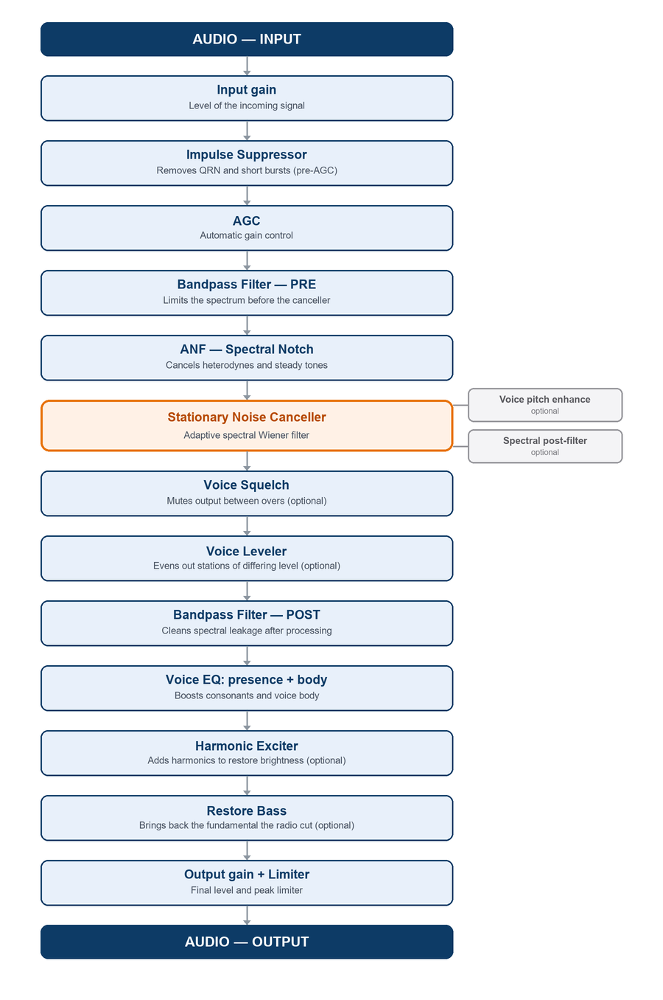

# RadioNoiseKiller — User Manual

**Version 1.9**

---

## Introduction

**RadioNoiseKiller** is a Windows and Linux application that processes the audio of an AM/SSB radio in real time before it reaches your speakers or headphones. It sits between the radio's audio output (or SDR receiver) and final playback, acting as a chain of digital filters designed specifically for the kind of noise found on shortwave and AM bands.

### What is it for?

In amateur radio and shortwave listening, audio is usually degraded by:

- **Band noise** (static, white background noise)
- **Atmospheric impulses** (QRN, electrical discharges, crackle)
- **Tone interference** (heterodynes, AM carriers from other stations, mains harmonics)
- **Excessive bandwidth** (frequencies outside the voice range that add unnecessary noise)

The application applies a series of chained processes — the **pipeline** — where each stage attacks one specific kind of degradation. The result is cleaner audio with better voice intelligibility, without introducing audible artificial artifacts.

### How is it used in practice?

1. Connect the radio's audio output to a PC input (line in, or a virtual cable for software SDR).
2. Select that input as the **input device** in the application.
3. Select your speakers or headphones as the **output device**.
4. Set the mode (AM or SSB) and press **START**.
5. Adjust the modules to match the signal type and propagation conditions.

### What the application does NOT do

- It does not demodulate the RF signal — it receives already-demodulated audio.
- It does not correct the level of propagation fading — although **HF fading compensation** (Ch. 7) keeps the noise canceller from drifting during fades.
- It does not improve signals with a very low signal level (S-meter) — it needs some signal to work with.

---

## Glossary of terms

Terms used throughout this manual, in alphabetical order. Experienced operators can skip this chapter and come back when they run into an unfamiliar term.

| Term | Meaning |
|------|---------|
| **AGC** | Automatic Gain Control. Continuously adjusts the volume to keep a stable output level: it amplifies weak signals and attenuates strong ones. |
| **AM / SSB** | The two supported reception modes. **AM** (amplitude modulation): broadcasting and commercial shortwave, wide bandwidth. **SSB** (single sideband): the usual voice mode in HF amateur radio, more efficient but with the voice compressed in frequency. |
| **ANF** | Automatic Notch Filter. Detects and removes continuous tones (heterodynes, carriers, mains hum) without affecting the voice. |
| **Attack / Release** | Reaction times of a dynamics processor. **Attack:** how fast it reacts when the signal rises. **Release:** how fast it recovers when the signal falls. |
| **Bin (spectral)** | Each of the frequency "cells" the FFT divides the spectrum into. The noise canceller decides bin by bin how much to attenuate. |
| **Bypass** | Passing the audio through unprocessed. Useful for comparing the sound with and without the application. |
| **Carrier** | An unmodulated radio signal (a pure RF tone). In demodulated audio it appears as a continuous whistle or as silence with background noise, depending on the mode. |
| **dB / dBFS** | **Decibel:** logarithmic level unit; +6 dB ≈ double the amplitude, −20 dB = one tenth. **dBFS** (*full scale*): decibels referenced to the digital maximum; 0 dBFS is the absolute ceiling before distortion, working levels are negative (e.g. −20 dBFS). |
| **DSP** | Digital Signal Processing. All the work the application does on the audio: filters, noise cancellation, equalization. |
| **Fading / QSB** | Slow rises and falls of the signal level due to changes in ionospheric propagation, typical of shortwave. QSB is its Q code in amateur radio. |
| **FFT / Spectrum** | The FFT (*Fast Fourier Transform*) decomposes audio into its component frequencies. The **spectrum** is that representation: how much energy exists at each frequency. |
| **Bandpass filter** | A filter that only passes frequencies between a lower and an upper limit (e.g. 200–3000 Hz for SSB), removing everything else. |
| **Gate** | An audio gate: open, it lets sound through; closed, it silences it completely. It is the mechanism behind the squelch. |
| **Harmonics** | Multiples of a sound's fundamental frequency. The human voice concentrates its energy in the fundamental (80–400 Hz) and its harmonics — that structure is what distinguishes voice from noise. |
| **Heterodyne** | A continuous tone (whistle) produced by a carrier close to the tuned frequency. The ANF removes them automatically. |
| **Hold** | The time the squelch keeps the gate open after the voice disappears, to avoid cutting word endings or brief pauses. |
| **Hz / kHz** | Hertz: frequency unit (cycles per second). 1 kHz = 1000 Hz. SSB voice occupies roughly 200–3000 Hz. |
| **MCRA** | **Adaptive** noise estimation mode (*Minima Controlled Recursive Averaging*). Estimates the noise floor continuously and automatically, with no need to "learn" a profile manually. The alternative to the Static profile. |
| **Noise floor** | The constant background noise level of the band. Everything below it is inaudible; the useful signal must rise above it. |
| **Noise profile** | A "photograph" of the band noise the canceller uses as a reference. In static mode it is learned manually (3–5 s without signal); in Adaptive (MCRA) mode it is estimated automatically. |
| **Pipeline** | The processing chain: the ordered sequence of stages the audio passes through from input to output. |
| **Pitch (f0)** | The fundamental frequency of the voice — the "tone" a person speaks at (80–400 Hz). The application detects it to protect the voice harmonics and for the squelch. |
| **Preset** | A saved set of all DSP and gain settings, to load complete configurations at once (Presets tab). |
| **Q (selectivity)** | The quality factor of a filter: how narrow it is. Low Q = affects a wide band of frequencies; high Q = a narrow, selective peak. |
| **QRN** | Q code for atmospheric noise: electrical discharges, storms, impulsive crackle. Handled by the Impulse Suppressor. |
| **RMS** | Root Mean Square: a measure of a signal's average level, more representative of perceived loudness than the peak value. |
| **SDR** | Software Defined Radio. Receivers whose demodulation happens on the PC (SDR#, HDSDR, etc.); their audio can be processed with this application using a virtual audio cable. |
| **SNR** | Signal-to-Noise Ratio: how many times the signal exceeds the noise. High SNR = clean signal; low SNR = signal buried in noise. |
| **Squelch** | A silencer: suppresses the audio output when no transmission is present, removing band noise between overs. |
| **Threshold** | A detector's trigger value: above it, the detector acts; below it, it doesn't. Several modules have a configurable threshold (squelch, ANF, impulse suppressor). |
| **VAD** | Voice Activity Detector. Decides in real time whether what is heard is human voice or just noise; it feeds the squelch and the canceller. |
| **Wiener (filter)** | A mathematical noise reduction technique that attenuates each spectrum bin in proportion to how much noise it contains. It is the heart of the Stationary Noise Canceller. |

---

## Pipeline diagram

Audio flows through the following processes in order. Each stage can be enabled or disabled independently:

---

## Chapter 1 — Audio Devices

**Location:** Main tab → "Audio Devices" group

### Description

Selects where the audio comes from (input) and where it goes (output). On Windows the application only shows **WASAPI** and **WDM-KS** devices, the lowest-latency Windows drivers.

### Controls

| Control | Description |
|---------|-------------|
| **Input** | Audio source. It can be a physical input (line in, microphone), a virtual audio device (VB-Cable, etc.) or "Stereo Mix" to capture what another application plays. |
| **Output** | Destination of the processed audio. Typically your speakers or headphones. |
| **⟳ (rescan)** | Rescans the audio devices without closing the application — for when hardware (USB interface, headphones) is plugged or unplugged while the program is open. The current selection is kept if the device is still present. Only available while processing is stopped. |
| **Channel** | Channel taken from the input when it is stereo: **Left** (default), **Right** or **L+R mix**. Applies live, without restarting processing. Has no effect with mono inputs. |

### Tips

- If you use a software SDR (HDSDR, SDR#, etc.), configure that program to output to a **virtual audio cable** and select that cable as the input here.
- If the list is empty or incomplete, or new hardware was plugged in while the program was open, use the **⟳** button to rescan the devices (with processing stopped). If a device is still missing, restart the application.
- Changing devices requires stopping and re-starting processing — that is why the Input/Output selectors are disabled while processing is active (the Channel selector stays enabled: it applies live).
- If you hear nothing from a stereo USB interface, try **Channel: Right** — radio audio is often wired to that channel.
- The input and output must belong to the **same Windows API** (both WASAPI, or both WDM-KS): a full-duplex stream cannot mix APIs. If you pick an incompatible combination (for example a WASAPI input plus an output that only exists under WDM-KS, such as "Stereo Mix"), the application **disables the START button**, outlines both selectors with a warning border and explains the reason in the status bar. Pick both devices from the same API to be able to start.
- On **dual-receiver** radios (main RX on the left channel, sub-RX on the right), the Channel selector picks which one to process. The processed output always plays in both ears.

---

## Chapter 2 — General Control

**Location:** Main tab → "Control" group

### Description

The main operating controls: reception mode, AGC and processing activation.

### Controls

| Control | Description |
|---------|-------------|
| **Mode** | Selects the type of received signal: **AM** (amplitude modulation, wider bandwidth) or **SSB** (single sideband, voice compressed in frequency). Affects the default limits of the Bandpass Filter. |
| **AGC** | Automatic Gain Control. **off** = no AGC. **slow / medium / fast** = response speed (attack/release fixed per preset). For SSB, *slow* or *medium* is recommended; for AM with stable signals, *off* or *slow*. |
| **▶ START / ■ STOP** | Starts or stops real-time processing. When started, audio flows through the whole pipeline. |
| **Bypass** | Passes audio straight from input to output with no processing. Useful for comparing the sound with and without the application active. |

### Interface language

The language selector (🌐 Español / English) sits in the **right corner of the status bar** (bottom edge of the window), visible from any tab. The change is saved instantly but **requires restarting the application** to take effect.

### AGC presets

The **AGC** combo on the Main tab offers three speeds with fixed attack/release, all with target −20 dBFS and max gain +36 dB:

| Preset | Attack | Release | Typical use |
|--------|--------|---------|-------------|
| **fast**   | 5 ms   | 500 ms  | Protects against sharp peaks; may "pump" with SSB voice. |
| **medium** | 25 ms  | 2000 ms | Balanced — a good general starting point. |
| **slow**   | 100 ms | 5000 ms | Stable with deep QSB; the most natural for voice. |

With **off** the AGC is out of the pipeline. For SSB, *slow* or *medium* is recommended; for AM with stable signals, *off* or *slow*.

---

## Chapter 3 — Active Modules

**Location:** **Modules** tab

> **New in v1.7:** the "Active Modules" moved from the Main tab to their **own tab ("Modules",
> second in the row)**, to keep the Main tab less cluttered. The controls and their behavior are
> identical; only the location changed.

### Description

Each checkbox enables or disables one pipeline module independently and in real time. Audio keeps flowing — the module is simply bypassed while disabled.

### Available modules

| Module | When to enable it |
|--------|-------------------|
| **Impulse suppressor** | Always on bands with QRN (storms, industrial noise). Disable on clean signals to save CPU. |
| **Bandpass filter (pre)** | Almost always on. Limits the spectrum before the canceller. |
| **ANF — Removes heterodynes and tones** | Enable when you hear steady tones (whistle, hum). Disable with digital/data signals (PSK, FT8) since it would treat them as interference. |
| **Stationary noise canceller** | The main module. Enable once the noise profile has been learned. |
| &nbsp;&nbsp;&nbsp;↳ **Perceptual spectral floor** | Canceller sub-module. Replaces the fixed floor with a frequency-dependent curve: raises the floor in the vocal zone (~500 Hz, preserves voice warmth) and lowers it at high frequency (suppresses hiss harder). Curve adjustable in Advanced Canceller. |
| &nbsp;&nbsp;&nbsp;↳ **Spectral post-filter** | Canceller sub-module. Removes the "musical noise" (intermittent birdies) the Wiener filter leaves behind. Enable when you notice that artifact. Aggressiveness adjustable in Advanced Canceller. |
| &nbsp;&nbsp;&nbsp;↳ **Voice pitch enhancement** | Canceller sub-module. For very weak voice signals (AM or SSB): detects the voice's fundamental pitch and protects its harmonics from being suppressed — improves intelligibility. Enable if the voice sounds "ghostly" with the canceller at maximum. Sensitivity adjustable in Advanced Canceller. |
| &nbsp;&nbsp;&nbsp;↳ **Voice squelch** | Canceller sub-module. Mutes the audio between transmissions with a progressive close (no warble, no noise tail). **Do not use with music.** Voice level and gate indicators in Advanced Canceller. |
| &nbsp;&nbsp;&nbsp;↳ **HF fading compensation** | Canceller sub-module, Adaptive mode only. Freezes the noise estimator during ionospheric fades (QSB) and speeds up recovery when the signal returns. Sensitivity and duration in Advanced Canceller. |
| &nbsp;&nbsp;&nbsp;↳ **Voice leveler** | Canceller sub-module. A voice AGC applied *after* noise reduction: keeps the clean voice at a constant level even as band conditions (and the amount of cancellation) vary. Only adapts while voice is detected — noise between transmissions is not re-amplified. |
| **Bandpass filter (post)** | Almost always on together with pre. Cleans up spectral-processing artifacts. Runs after the canceller and the squelch (this list reflects the pipeline order). Its limits can be made independent from the input (see Ch. 5). |
| **Voice EQ (presence + body)** | Two parametric bands: presence (clarity, 1–2 kHz) and body (warmth, 150–800 Hz). Enable to shape the voice on weakened or heavily filtered signals. |
| **Harmonic exciter** | For dull voice signals lacking brightness. Adds presence. Compare with and without to decide. |

> **Tip — enable one at a time:** when building a configuration (or on a new signal), enable and disable the modules **one at a time**, listening to the effect each one produces. Since all changes apply live, you hear the difference instantly: that lets you tune each module better — or simply drop it if it brings nothing on that signal. Enabling everything at once makes it impossible to tell what is helping and what is not.

---

## Chapter 4 — Impulse Suppressor

**Location:** Advanced Impulse tab → "Impulse suppressor" group

### Description

Detects and attenuates short high-energy transients: atmospheric discharges (QRN), power lines, electric motors and any impulsive interference. It operates **before** the AGC and the noise canceller, with two cascaded detection levels.

- **Level 1 (10 ms frame):** detects energy bursts lasting several milliseconds, typical of large atmospheric discharges.
- **Level 2 (0.67 ms micro-frame):** detects very short impulses — crackle, static, nearby devices switching on.

The **Activity** indicator shows in real time how many impulses per second are being detected (⚡ N /s).

### Controls

| Control | Range | Default | Description |
|---------|-------|---------|-------------|
| **Frame threshold (10 ms)** | 5× – 100× | 15× | Sensitivity of the long-frame detector. Low = more aggressive (catches more impulses but may affect the voice). High = only blanks very strong pulses. **Lower it** if discharges remain audible; **raise it** if the voice sounds clipped. |
| **Micro threshold (0.67 ms)** | 3× – 30× | 8× | Sensitivity for very short crackle. Works like the previous control but on a microsecond scale. |

### Recommended values by situation

| Situation | Frame threshold | Micro threshold |
|-----------|-----------------|-----------------|
| Clean band, no QRN | 50× | 20× |
| Moderate QRN | 15× | 8× |
| Nearby thunderstorm | 8× | 5× |

---

## Chapter 5 — Bandpass Filter

**Location:** Advanced Audio tab → "Bandpass filter" group

### Description

A Butterworth IIR filter that limits the audio bandwidth to the frequencies useful for voice. It is applied at **two points** in the pipeline:

- **Pre (before the canceller):** limits the spectrum the canceller "learns" as noise. Prevents the canceller from trying to suppress energy outside the vocal range.
- **Post (after the canceller):** removes spectral artifacts that the canceller's STFT processing can introduce outside the useful band.

Both are enabled/disabled independently from **Active Modules**.

### Controls

| Control | Range | AM default | SSB default | Description |
|---------|-------|-----------|-------------|-------------|
| **AM low Hz** | 50–1000 Hz | 300 Hz | — | Lower cutoff frequency for AM. |
| **AM high Hz** | 1000–10000 Hz | 5000 Hz | — | Upper cutoff frequency. Raise up to 10 kHz for local AM stations with hi-fi audio. |
| **SSB low Hz** | 50–1000 Hz | — | 200 Hz | Lower cutoff for SSB. |
| **SSB high Hz** | 1000–5000 Hz | — | 3000 Hz | Upper cutoff for SSB. |
| **Filter order** | 2 / 4 / 6 / 8 | 4 | 4 | Filter slope. Higher order = sharper cutoff = better out-of-band rejection, but more phase latency. For normal use, order 4 is adequate. |

### Output independent from input

By default, the output filter uses **the same limits** as the input one. The **"Output independent from input"** checkbox enables four dedicated sliders (AM/SSB output, low/high) to decouple them.

Why? Two identical cascaded filters double the attenuation at the band edge: the top of the voice arrives **doubly dulled**. With an independent output you can use:

- **Narrow input** (e.g. SSB up to 2700 Hz): less hiss enters the noise canceller.
- **Wider output** (3500–4000 Hz): the voice keeps its natural upper edge and the brightness regenerated by the Harmonic Exciter passes through fully. The output filter still cleans artifacts above its own cutoff.

Rule of thumb: output **equal to or wider** than the input. Narrower than the input re-clips useful signal with no benefit.

### Tips

- For **local AM stations with good music** or quality audio: raise the high Hz up to 7000–10000 Hz.
- For **SSB DX** with heavy noise: lower the low Hz to 300–400 Hz and the high to 2500 Hz to reduce band noise.
- Changing the filter order requires restarting processing (the control is disabled while active).

---

## Chapter 6 — ANF: Spectral Notch Filter

**Location:** Advanced Impulse tab → "ANF — Removes heterodynes and interfering tones" group

### Description

The **ANF** (Adaptive Notch Filter) automatically detects steady or nearly steady tones in the spectrum — heterodynes, AM carriers from adjacent stations, mains hum (50/60 Hz and its harmonics) — and attenuates them without affecting the surrounding voice audio.

The algorithm compares each FFT bin's magnitude with the median of its neighbors. If a bin exceeds N times the surrounding level, it is considered a tone and a notch is applied. It has no state between frames, which makes it very reactive but also keeps it from "chasing" voices.

The **Activity** indicator shows how many tones are being notched at this moment.

> **Important:** Do not use the ANF with digital signals (FT8, PSK31, WSPR, etc.). Those signals have a spectral structure the ANF interprets as tones to remove.

### Controls

| Control | Range | Default | Description |
|---------|-------|---------|-------------|
| **Sensitivity** | 1.5× – 10× | 3.0× | Minimum bin/surroundings ratio to consider a tone. **Lower it** (1.5–2.5×) to catch weak tones that barely stand out. **Raise it** (5–10×) to be more selective and only remove very strong interference. |
| **Depth** | 0% – 100% | 50% | How much the detected tone is attenuated. 100% = silences the bin completely. 50% = 6 dB reduction. **High values muffle the voice** — 50% (new default in v1.7) is a good balance between cancelling the tone and not dulling the voice. Raise to 90–100% only for very annoying heterodynes, watching that the voice doesn't get muffled. |

---

## Chapter 7 — Stationary Noise Canceller

**Location:** Main tab → "Stationary Noise Cancellation" group and Advanced Canceller tab → "Stationary noise canceller" group

### Description

This is the application's core module. It implements a spectral **Log-MMSE Wiener filter** with a DD (Decision-Directed) estimator that reduces stationary background noise — band static, white noise, propagation noise — while preserving the voice.

The Log-MMSE estimator (Ephraim & Malah, 1985) computes the optimal gain bin by bin, minimizing distortion on a logarithmic scale, which matches auditory perception. This produces less residual "metallic" quality in the voice compared to the classic Wiener filter, especially on weak signals.

### Noise estimation modes

The canceller offers two modes, selectable from the **Mode:** selector on the Main tab:

**Static profile** (manual mode)
The algorithm learns a "photo" of the background noise over a few seconds and uses it as a fixed reference. Ideal when the band noise is very stable.

1. **Find a noise-only gap** — a moment with no signal, when the station is not transmitting.
2. Press **⏺ Learn noise** and wait 3–5 seconds.
3. Press **⏹ Stop** — the profile is stored and applied.
4. If conditions change a lot, repeat the process.
5. **Clear profile** resets the reference.

> **Important — learn noise only:** it's best to **tune slightly off frequency** to a spot on the dial **with no stations** (just the band's background noise), learn there, and only then return to the station. If some **voice or a carrier** slips in during learning, that energy gets "baked" into the noise profile, and the canceller then subtracts it as if it were noise — you'll hear artifacts and holes over the real voice. The profile should be a snapshot of **pure noise**, not of the signal.

During learning the application takes two automatic measures to capture a faithful profile:

- **The AGC is frozen.** Without this, the AGC would progressively amplify the band noise up to its target level and the profile would capture a sweep of levels instead of a stable one.
- **Monitoring is attenuated −12 dB.** Listening to raw noise at full volume for 3–5 seconds is unpleasant; the attenuation only affects what you hear — the algorithm analyzes the signal at full level.

Both measures are released automatically when you press ⏹ Stop (or cancel learning).

**Named noise profiles** (save and reuse)

Learning the profile every time you open the application is tedious. With the **"💾 Save profile..."** and **"📁 Profiles..."** buttons (under Learn/Clear, static mode only) you can save the current profile under a name and load it again when needed:

1. Learn a profile as usual (or load a saved one and re-adjust).
2. **💾 Save profile...** → type a descriptive name ("40m home", "20m field", "laptop noise").
3. In another session, **📁 Profiles...** → pick the profile from the list to load it instantly, without learning it again.

Profiles are stored as `.json` files in the **`PerfilesRuido/`** folder next to the executable (they can be backed up or copied between machines). Loading a profile automatically switches the canceller to static mode.

**Auto-reload:** the last profile saved or loaded is remembered across sessions — when you open the application it is applied automatically (the status bar confirms it), so you start operating with a reference without re-learning anything. If the profile was learned with a different block size, it adapts automatically by interpolation.

**Adaptive (MCRA)** (automatic mode)
The algorithm estimates the noise floor continuously in real time, with no manual learning. It calibrates in ~200 ms when processing starts and adapts automatically when propagation conditions change, QRM appears or the band noise varies.

- Requires no user intervention — it just works.
- The Learn/Clear buttons are hidden (they don't apply in this mode).
- The status indicator changes from "calibrating..." to "estimating in real time" once ready.
- **Recommended** for long listening sessions where band conditions vary.

**Floor memory across carrier squelch**

When the radio's squelch cuts the carrier (total silence between transmissions), the MCRA automatically detects that the frame energy has dropped far below the estimated noise floor and **freezes** the estimator's entire state: it updates neither the spectral smoothing, nor the minima tracking, nor the noise estimate `λ_d`. When the signal returns, the algorithm resumes from exactly the memorized profile — with no re-calibration period and no audible noise at the start of the transmission.

This behavior is automatic and requires no adjustment. It triggers when the signal drops more than 13 dB below the estimated floor, which distinguishes a real squelch (carrier cut) from a normal pause between words where band noise remains present.

**HF fading compensation** (Adaptive mode only)

**Enable:** Modules tab → "HF fading compensation" checkbox (canceller sub-module)
**Calibrate:** Advanced Canceller tab → "Fading sensitivity" and "Freeze duration" sliders

On shortwave with ionospheric fading (QSB), the signal rises and falls several times per minute. Without compensation, this produces two audible problems:

1. During the fade, the adaptive estimator interprets the signal drop as a lower noise floor and re-calibrates downwards. When the signal returns, the floor is out of date and unattenuated noise is heard until the estimator readjusts (~800 ms).
2. The Wiener gain estimator follows the signal level with a delay: when the signal comes back from a fade, it "arrives late" and clips the start of the voice while dragging noise along.

The compensation attacks both problems:

- **Estimator freeze (voice-smart):** when it detects an abrupt energy change, it freezes the noise floor estimate **only if voice is present** — that is, on a *signal* fade. The pre-fade floor is preserved and applied immediately when the signal returns. **Important:** if the energy change is a **rise of the band noise** (no voice structure), the estimator does **NOT** freeze and keeps following the noise in real time. This prevents the floor from lagging when the noise rises and falls cyclically (see "Floor reactivity" below).
- **Accelerated release:** during a fading event, the Wiener gain responds to signal rises in ~20–30 ms instead of 100–150 ms. Voice emerging from a fade opens up without perceptible delay.

Two sliders in Advanced Canceller calibrate the detection:

| Control | Range | Default | Description |
|---------|-------|---------|-------------|
| **Fading sensitivity** | 1 – 10 dB | 5 dB | Energy change that triggers the freeze (with voice present). Sensitive (1–4 dB): detects mild QSB. Selective (7–10 dB): deep fades only. |
| **Freeze duration** | 100 – 500 ms | 200 ms | How long the estimator stays frozen after each event. Slow fades need more; a very long value lets the floor go stale if the band noise really did change. |

The indicator in Advanced Canceller shows **FADE** (orange) while the estimator is frozen by a signal fade, and **ok** (gray) otherwise. Since the freeze now only engages with **voice present**, it is normal for FADE to stay almost always at **ok** with music or pure noise — that confirms the estimator is free to follow the noise (exactly what you want). With a voice signal under QSB, FADE lights on each fade.

> **When to enable it:** shortwave listening (SSB or AM DX) with noticeable fading, always in Adaptive mode. It no longer interferes with cyclic noise (it does not freeze on noise rises), so it can be left on alongside Floor reactivity. In Static profile mode it has no effect.

### Real-time indicators (Advanced Canceller)

| Indicator | Description |
|-----------|-------------|
| **Reduction (dB)** | How much noise is being reduced right now. Green = strong reduction (>10 dB). Yellow = moderate reduction. |
| **Voice (%)** | Probability that the current frame contains voice (the smoothed signal used internally by the Wiener filter). To calibrate the Squelch, use the **Voice level** indicator in the Squelch group (more reactive). |
| **Preview: listen to removed noise** | Inverts the output so you hear only what is being removed. Useful for checking that no voice is being removed. |

### Advanced controls (Advanced Canceller tab)

| Control | Range | Default | Description |
|---------|-------|---------|-------------|
| **Intensity** | 0% – 100% | 70% | How much reduction is applied on top of the computed gains. **0%** = no reduction (audio passes unchanged). **100%** = full reduction. The scale is non-linear: mid values (50–70%) already produce a noticeable reduction, while voice bins are minimally affected at any position. Start at 70% and raise it according to the noise level. |
| **Spectral floor** | 0.05 – 0.30 | 0.10 | Minimum gain applied to any bin, even the noisiest. 0.10 means no bin is ever silenced by more than 90% of its energy. **Never go below 0.05** — very low values with a high Anti-warble produce severe warbling. |
| **Anti-warble (β)** | 90% – 99% (0.1% steps) | 97% | How fast the gains return to the floor after voice is detected. High (97–99%) = smooth transitions, no warble. Low (90–95%) = more reactive but with a risk of audible warble. The fine 0.1% resolution allows precise calibration at the high end, where each tenth audibly changes the release (98.0% ≈ 0.5 s; 98.5% ≈ 0.7 s; 99.0% ≈ 1 s). The maximum removes the most persistent warble but can leave a noise "tail" after each transmission — use it only if 97–98% is not enough. |
| **Attack speed** | 50% – 92% | 80% | How fast the canceller "opens" voice bins when a signal is detected. Fast (50–70%): crisper consonants. Soft (>85%): fewer transition artifacts. |
| **Floor reactivity** *(Adaptive only)* | 250 – 800 ms | 800 ms | Window over which the MCRA estimator tracks the noise minimum. **Reactive (250–350 ms):** the floor follows fast cyclic rises and falls of the noise without lagging (less "swaying" of the sound). **Stable (800 ms):** better for steady noise. Lower it when the band noise rises and falls suddenly in short cycles. With very reactive values, keep **Voice pitch enhancement** on (protects the harmonics from a short window mistaking them for noise). |
| **HF floor boost** *(Adaptive only)* | 0% – 150% | 0% | Raises the estimated noise floor above ~2.5 kHz, where noise energy is low and the estimator reacts late. Suppresses the HF hiss that leaks through with fading better. The curve is **logarithmic**: each octave above 2.5 kHz adds more boost, so it acts progressively harder the higher the frequency. **Cost:** it can dull the voice's brightness a bit — compensate with the **Harmonic exciter** or the **Presence EQ** (they regenerate brightness after the canceller, without bringing the noise back). |

> **Tip — calibrating Intensity with the Preview:** enable **"Preview: listen to removed noise"** and raise the **Intensity** while listening to what is being removed: as long as the preview contains only noise, you can keep raising it; at the point where voice starts leaking into the removed audio, back off one step and leave it there. That is the maximum cancellation that does not touch the voice. Disable the preview when done.

> **Recipe — shortwave noise that rises and falls in short cycles:** a typical problem is band noise fluctuating several dB cyclically and fast, while the signal stays at a steady level. Without tuning, the estimator lags: on the rise it lets noise through, on the fall it eats the voice — a "swaying" of the sound. The combination that fixes it, all in **Adaptive mode**:
> 1. **Floor reactivity** at **250–350 ms** — so the floor follows the noise's rise and fall.
> 2. **HF floor boost** at **50–100%** — for the treble hiss the estimator can't follow on its own.
> 3. **Voice pitch enhancement** on — protects the voice harmonics from the reactive window.
> 4. **HF fading compensation** can be left **on**: it is now smart and does not freeze on noise rises (only on voice fades).
> 5. If the voice brightness got dull from the HF floor boost, compensate with the **Harmonic exciter** (drive 2–3×) or **Presence EQ** (+4–6 dB at 2 kHz).
>
> Watching the **Spectrum** tab, the goal is for the floor line (yellow) to follow the noise's rise and fall instead of lagging behind.

### Floor vs. Anti-warble

These two parameters interact. The practical rule:

| Situation | Floor | Anti-warble |
|-----------|-------|-------------|
| Radio with good S/N | 0.10 | 97% |
| Radio with variable noise | 0.15 | 97–98% |
| Very weak signal, heavy noise | 0.15–0.20 | 98% |

**Low floor + low anti-warble** inevitably produces warbling. Raise the floor first, then adjust the anti-warble.

### Perceptual spectral floor

**Enable:** Active Modules → "Perceptual spectral floor (auditory masking curve)" checkbox  
**Adjust:** Advanced Canceller tab → "Perceptual spectral floor" group

The standard **Spectral floor** control applies the same minimum gain at all frequencies. But the ear does not perceive residual noise equally across bands: in the vocal-fundamentals zone (~300–800 Hz) a slightly higher floor sounds more natural and warm, while above 3 kHz residual noise (hiss) is the most annoying and is worth suppressing harder.

This module replaces the fixed floor with a three-zone curve:

- **Vocal boost:** the floor rises around the configured center frequency (default 500 Hz). Preserves voice warmth.
- **Neutral zone** (1–3 kHz): unchanged — formants pass with the base floor.
- **Treble rolloff:** above the configured start frequency, the floor drops progressively. Suppresses high-frequency hiss harder.

**Real-time indicators:**

| Indicator | Description |
|-----------|-------------|
| **Vocal floor** | The floor value at the maximum-boost frequency, in % and in dB relative to the base floor. E.g. "25% (+8.0 dB)" means the floor at the vocal center is 0.25 while the base is 0.10. |
| **Active** | Percentage of spectrum bins the floor is currently holding up. **If it reads 0%, the module is having no effect** — the Wiener filter is already producing gains above the floor and moving the sliders will change nothing audible. With band noise present, 20–50% is normal. |

**Controls:**

| Control | Range | Default | Description |
|---------|-------|---------|-------------|
| **Vocal boost amount** | 0% – 250% | 75% | How much the floor rises in the vocal zone relative to the base floor. 75% = soft, 150% = normal, 250% = strong. Raise it if the voice sounds "cold" or hollow with the canceller active. |
| **Boost center** | 200 – 1200 Hz | 500 Hz | Frequency of maximum boost. 400–600 Hz for male voices, 600–900 Hz for female voices. |
| **Rolloff start** | 1000 – 6000 Hz | 3000 Hz | Frequency where the floor starts dropping. **On SSB (narrow band ~2.7 kHz), lower it to 1500 Hz** — with the 3000 default the rolloff starts above the band and never engages. |
| **Rolloff depth** | 0% – 95% | 55% | How much the floor drops at the treble end → more high-hiss suppression. 55% ≈ −7 dB. More depth = less residual hiss, at the cost of slightly dulling the voice's highs. |

> **Tip — barely noticeable on SSB:** the Depth's effect concentrates above the "Rolloff start". If you're on SSB and don't notice it, **don't raise the Depth — lower the "Rolloff start"** to ~1500 Hz so the rolloff falls inside your band. On AM (wider band) the effect shows directly. In v1.7 the ramp is steeper (reaching full depth near the band edge) and the maximum went from 70% to 95%.

> **Tip:** use the **Active** indicator as a guide. If it reads 0% consistently, the base floor (the "Spectral floor" control) is already below the gains the Wiener computes and the perceptual curve never engages — in that case the relevant adjustment is the canceller's Intensity, not this curve.

### Spectral post-filter

**Enable:** Active Modules → "Spectral post-filter (residual musical noise)" checkbox  
**Adjust:** Advanced Canceller tab → "Spectral post-filter" group

Even a well-configured Wiener filter can leave a very particular artifact called **musical noise**: instead of the original uniform background noise, short intermittent birdies appear, varying randomly from bin to bin. It is the residue of bins the VAD marked as noise but that were not fully suppressed by the spectral floor.

The post-filter applies a second pass over those bins using the same voice-probability information: on bins with residual noise (`p_speech ≈ 0`) the gain is reduced further; on voice bins (`p_speech ≈ 1`) nothing changes.

**Real-time indicator:**

| Indicator | Description |
|-----------|-------------|
| **Extra reduction** | How many additional dB the post-filter is removing on noise bins, beyond what the base canceller already does. Green above −5 dB, yellow between −0.5 and −5 dB, gray when there is no active noise or the module is disabled. Lets you verify at a glance that the aggressiveness slider is having real effect. |

| Control | Range | Default | Description |
|---------|-------|---------|-------------|
| **Aggressiveness** | 0.0 – 10.0 | 1.0 | Strength of the second pass. **0** = off (even with the checkbox enabled). **1** = normal: pure-noise bins get `gain²` (doubles the reduction in dB). **2** = aggressive: `gain³`. **4** = very aggressive: `gain⁵`. **10** = maximum: `gain¹¹` — on pure-noise bins suppression saturates at the internal floor (−46 dB); the high range mostly acts on intermediate voice/noise bins. Start at 1.0 and raise it, watching the Extra reduction indicator, until the musical noise disappears. |

> **Note:** High values (>2.5) with very low SNR signals can over-suppress the edges of voice transitions — and above 4 the effect on intermediate bins is strong: it can reduce voice clarity (word endings, breaths). If the voice starts to sound clipped or dull, reduce. On pure background noise there is no audible difference beyond ~5 (suppression already saturates); the high range is heard on the noise riding along with the voice.

> **Tip — low Intensity + high post-filter:** a very effective combination is to **lower the canceller's Intensity** (50–60%) and compensate with **high post-filter Aggressiveness** (5–8). The low Intensity lets the voice through almost untouched — without the dullness that appears when raising it — while the post-filter handles the remaining noise, acting only on the bins the detector marks as noise. On many signals this yields better cancellation **with a more natural voice** than raising the Intensity alone. It is worth trying both approaches on each signal and keeping whichever sounds best.

### Voice pitch enhancement

**Enable:** Active Modules → "Voice pitch enhancement (autocorrelation detection)" checkbox  
**Adjust:** Advanced Canceller tab → "Harmonic protection" slider

On very weak voice signals buried in noise, the Wiener canceller can suppress the voice harmonics along with the noise because the VAD cannot tell them apart. The result is a voice that sounds "ghostly", with shifting tone or lost naturalness.

This module detects the voice's **fundamental pitch** (f0) in real time via autocorrelation over a 42 ms window, searches for f0 in the 80–400 Hz range, and raises the voice probability (`p_speech`) on all bins corresponding to harmonics of that f0. The canceller then treats them as voice and lets them through.

- Detection uses a **confidence threshold**: if the signal is not periodic enough (no clear voice), nothing is modified.
- **3-frame hold:** on brief detection gaps, the last valid f0 is kept to avoid fluttering.
- **Works on both AM and SSB.** On AM, demodulation preserves the voice's harmonic structure exactly, so detection is just as reliable; the confidence threshold protects in very noisy conditions. On SSB, an off-tune BFO shifts the harmonics and can degrade detection — adjust the clarifier if the indicator never detects.

**Real-time indicator:**

| Indicator | Description |
|-----------|-------------|
| **Detected pitch** | The voice's f0 in Hz, in real time. Green = detection active (the harmonic mask is protecting the voice). "no detection" (gray) = no periodic signal — the module is in passthrough. With clear voice it should read a stable value between 80–400 Hz; if it flutters erratically or never detects, the signal is too noisy or (on SSB) the radio's clarifier is off-tune. |

| Control | Range | Default | Description |
|---------|-------|---------|-------------|
| **Harmonic protection** | 0% – 100% | 70% | How much `p_speech` is raised on harmonic bins. **70%** is the balance point: protects the voice without degrading noise suppression. **>85%**: harmonic bins are almost never suppressed — useful for very weak signals. **<40%**: minimal effect. |

> **When to enable it:** when the voice sounds "ghostly" or "robotic" with the canceller in MCRA mode or at high intensity, on weak AM or SSB signals — it improves intelligibility in both modes. Under normal conditions, leave it off.

### Voice leveler

**Enable:** Active Modules → "Voice leveler (compensates band conditions)" checkbox  
**Adjust:** Advanced Audio tab → "Voice leveler" group

In a real listening session the level of the clean voice varies constantly: propagation changes, stations change, and the amount of noise cancellation itself removes more or less energy depending on conditions. The leveler is an **AGC dedicated to the voice** that works *after* the canceller and the squelch — that is, on the already-clean audio — and brings it to a constant level.

The difference from the general AGC (Ch. 2) is the **voice-detection gate**: by default the leveler only adapts its gain while the canceller's voice detector confirms voice is present. With noise or silence the gain stays **frozen** at its last value — residual noise between transmissions is not re-amplified, which is the typical flaw of chaining two ordinary AGCs. This gate can be disabled (**"Level continuously"** checkbox, see below) for **music or continuous audio**.

**Requires the Stationary noise canceller enabled with a profile** (learned or MCRA-calibrated) — the voice detector lives inside the canceller. The target (−20 dBFS) and attack (80 ms) are fixed; the **response speed (release) is adjustable** so it can follow faster or slower fading.

**Real-time indicators:** the gain the leveler is applying is shown in two places with the same data — on the Main tab (next to the peak limiter indicator) and as **"Activity"** inside the group itself in Advanced Audio, so you can watch it while adjusting the Max gain. Green while compensating, gray "0 dB" when the voice is already at level, "—" when the module is not running.

| Control | Range | Default | Description |
|---------|-------|---------|-------------|
| **Max gain** | 0 – 20 dB | +12 dB | Amplification cap for weak voice. Raise it for DX signals far below the target level; lower it if a strong station arriving after a weak one starts off too loud. At 0 dB the module only attenuates (never amplifies). |
| **Response speed** | 200 – 3000 ms | 1500 ms | How fast the leveler follows level changes (the AGC *release*). **Fast (200–600 ms):** follows fast cyclic fading without leaving volume "dips" when the signal drops. **Smooth (2000–3000 ms):** more stable leveling, less risk of pumping the background noise. |
| **Level continuously (music)** | checkbox | off | Disables the voice-detection gate: the leveler adapts **at all times**, without waiting for voice. **Enable for music or continuous audio** — where the voice detector does not recognize voice structure and, with the gate, the leveler would stay frozen. For voice on noisy bands leave it **off** (avoids re-amplifying noise in the gaps). |

> **When to enable it:** long sessions with stations at very different levels or pronounced QSB, especially with the squelch active (level jumps between transmissions are more noticeable when there is no background noise to mask them).

> **Music with fading (cyclic QSB):** enable the Leveler, tick **"Level continuously"**, raise Max gain to ~15 dB and lower the **Response speed to 400–600 ms**. This way the leveler tracks the signal's cyclic rise and fall instead of staying frozen waiting for a voice that never comes. If it starts to "breathe" the background noise, raise the speed one step. Related note: a high **Spectral floor** (Ch. 5) lets more signal through without flattening, so it passes more of the fading swing — if you notice it makes things worse, lower it a bit and let the leveler do the work.

---

## Chapter 8 — Voice Squelch

**Location:** Modules tab → "↳ Voice squelch" sub-module (under the Canceller)  
**Advanced settings:** Advanced Canceller tab → "Voice Squelch" group

> ⚠️ **Do not use with music.** The voice detector is calibrated for human voice. With music it produces sudden level rises and drops following the musical dynamics.

### Description

Completely mutes the output when the noise canceller detects no human voice. On SSB there is no carrier between transmissions — only band noise — and the squelch removes the residual noise left after reduction.

The voice detector does not measure energy alone: it requires **voice structure** — energy concentrated in harmonics and periodicity (autocorrelation) — and discounts the AGC gain. That is why band noise reads close to 0% on the indicator even when it fluctuates strongly or the AGC amplifies it after a transmission ends, while voice reads 80–100%.

It works as a **gate with progressive close**: with voice detected, audio passes unmodified; when the voice disappears, the gate stays at full volume for the first half of the Hold (pauses between words are untouched), fades smoothly during the second half, and ends in complete silence. If voice reappears at any point, the gate reopens instantly without clicks. There is no residual audio or warble in the closed state.

**Requires the Stationary noise canceller enabled** — the voice detector lives inside the canceller. If the canceller is off, the squelch stays in bypass (audio always passes). It also needs a learned noise profile (static mode) or the MCRA warm-up period (~200 ms).

### Real-time indicators (Squelch group, Advanced Canceller)

| Indicator | Description |
|-----------|-------------|
| **Voice level** | Percentage of vocal activity detected in the current frame, with fast response (~20 ms). Gray = pure noise. Yellow = marginal signal. Blue = voice detected, gate about to open. |
| **Gate** | Current gate state: **OPEN** (green, audio passes) or **CLOSED** (gray, silence). Stays OPEN during the Hold period after the voice ends. |

### Controls

| Control | Range | Default | Description |
|---------|-------|---------|-------------|
| **Squelch threshold** | 5% – 100% | 15% | Minimum voice activity to open the gate, on the same scale as the **Voice level** indicator. Since the detector requires voice structure, noise reads ~0% and a high threshold is unnecessary: **10–25% covers most cases**. Lower it to 5–10% for very weak signals; raise it only if some tonal interference (e.g. a heterodyne the ANF misses) opens the gate. |
| **Hold** | 0 – 1000 ms | 500 ms | Time from the end of the voice to total silence: full volume for the first half, progressive fade for the second. 500 ms suits normal SSB; with the current detector it can go down to 300 ms for a faster mute. Raise to 700–1000 ms for operators with long pauses between words. |

### Calibration

The **Voice level** indicator and the **Gate** state on the Advanced Canceller tab are the main calibration tools:

1. **With band noise only** (no transmission) → "Voice level" should read 0–10%, even with strong, fluctuating noise or with the AGC amplifying it. If it reads higher consistently, there is probably tonal interference — enable the ANF.
2. **With an active transmission** → "Voice level" rises to 80–100% and "Gate: OPEN".
3. Set the **Threshold** to 15–25%. For very weak signals that fail to open the gate, lower it to 5–10%.

> **If the gate never closes:** something with tonal or periodic structure is on the band (heterodyne, carrier). Enable the ANF to remove it, or raise the threshold above what the indicator reads.

> **Timing note:** after the voice ends, the indicator drops within ~100–150 ms; the gate stays at full volume for the first half of the Hold and fades during the second. If it cuts word endings, increase the Hold; if the noise takes too long to mute, reduce it.

---

## Chapter 9 — Voice EQ (Presence + Body)

**Location:** Advanced Audio tab → "Voice EQ" group  
**Enable:** Active Modules → "Voice EQ (presence + body)" checkbox

### Description

Two independent peaking EQ filters working on the two zones that define the character of a voice:

- **Body (150–800 Hz):** the zone of the voice fundamentals. Boosting it adds warmth, weight and "body" — useful when the voice sounds thin or telephone-like, which is common after bandpass filtering and noise reduction.
- **Presence (1000–2000 Hz):** the zone where the ear best discriminates consonants. Boosting it adds clarity and intelligibility — useful when the voice sounds "dull" or propagation attenuates the highs.

Both bands can be used at once: body +4 dB and presence +4 dB produce a fuller, clearer voice than either alone. Each band at 0 dB gain is exact passthrough (no processing cost).

### Controls

| Control | Range | Default | Description |
|---------|-------|---------|-------------|
| **Body frequency** | 150 – 800 Hz | 350 Hz | Center of the body peak. 250–400 Hz for male voices, 400–600 Hz for female voices. The width is fixed (Q 0.9 — roughly one octave). |
| **Body (gain)** | -3 dB to +10 dB | 0 dB | How much the voice body is boosted. +3 to +5 dB is the useful zone; beyond +6 dB it can sound "tubby". Negative values are also allowed to tame excessive lows. |
| **Presence frequency** | 1000 – 2000 Hz | 2000 Hz | Center of the boost peak. 2000 Hz emphasizes consonants (s, t, f). 1000–1500 Hz reinforces the midrange. |
| **Presence (gain)** | -3 dB to +10 dB | 0 dB | How much the center frequency is amplified. Start with +3 to +6 dB and adjust to taste. |
| **Q (selectivity)** | 0.2 – 2.0 | 0.7 | Width of the presence peak. Low Q (0.2–0.4) = wide peak, affects a broad band. High Q (1.5–2.0) = narrow, very selective peak. For radio voice, Q between 0.5 and 1.0 is typical. |

> **Tip:** if the voice loses body when the noise canceller is enabled, first try the **Perceptual spectral floor** (Ch. 7), which prevents the loss at the source. The body EQ compensates after the fact — the two approaches complement each other.

---

## Chapter 10 — Harmonic Exciter

**Location:** Advanced Audio tab → "Harmonic exciter" group

### Description

Generates artificial harmonics in the 1–4 kHz zone to restore the sense of "brightness" and "presence" lost to bandpass filtering and noise reduction.

The process takes the content above 1 kHz, saturates it gently with the *tanh* function (which generates 2nd and 3rd harmonics), extracts only the generated harmonics (without the original signal) and mixes them back into the audio at a low level.

The effect is similar to an analog exciter: the voice sounds more "airy", with more attack on consonants, without increasing the physical audio level.

**It is not a substitute for the presence EQ** — they are complementary. The EQ amplifies what exists; the exciter generates new energy correlated with the voice present.

### Controls

| Control | Range | Default | Description |
|---------|-------|---------|-------------|
| **Drive** | 1.0× – 10.0× | 2.0× | How much saturation is applied before extracting the harmonics. **Soft (1–3×):** mostly 2nd harmonic, subtle effect. **Aggressive (6–10×):** more higher-order harmonics, stronger effect but can sound artificial. Start at 2.0×. |
| **Mix** | 0% – 100% | 30% | How much of the generated harmonics is added back to the original audio. **20–40%** is the useful zone — noticeable without sounding artificial. Above 60% the effect becomes very pronounced. |

### Symptoms and adjustment

| Symptom | Adjustment |
|---------|-----------|
| The voice sounds "metallic" or "screechy" | Lower Drive (to 1.5–2.0×) |
| The effect is not noticeable | Raise Mix (to 40–50%) |
| It adds background noise | Check the canceller is enabled — the exciter also amplifies the noise's harmonics |

---

## Chapter 11 — Levels & Gain

**Location:** Main tab → "Levels & Gain" group

### Description

Controls the input and output levels and protects against audio peaks. The VU meters show the level in dB in real time for input and output.

### Controls

| Control | Range | Default | Description |
|---------|-------|---------|-------------|
| **Input** | -20 dB to +20 dB | 0 dB | Amplifies or attenuates the audio before the pipeline. Raise it if the radio's signal arrives weak (input VU in the -20 to -10 dB range). Lower it if it arrives saturated (VU in red). |
| **Output** | -20 dB to +20 dB | 0 dB | Amplifies or attenuates the pipeline output. Useful for compensating the level drop the noise canceller produces — with the noise suppressed, perceived loudness drops because the noise no longer adds to the total level. Raise 3–6 dB to compensate. |
| **Peak limit** | -12 dB to 0 dB | -1 dB | Maximum level allowed at the output. Prevents distortion from clipping. -1 dB is enough to avoid clipping without compressing the audio. |

### Peak limiter indicator

Below the **Peak limit** slider there is a real-time indicator:

- **—** (gray): the limiter is not acting — the output level is below the configured threshold.
- **ACTIVE  -X.X dB** (orange): the limiter is reducing light peaks (less than 3 dB of reduction).
- **ACTIVE  -X.X dB** (red): the limiter is working hard (more than 3 dB of reduction) — consider lowering the output gain or the peak limit.

On the same row, the **"Voice leveler"** indicator shows the gain that module is applying (see Ch. 7) — green while compensating a weak voice, "—" when the module is disabled.

### VU meters

- **Green** (-20 to -6 dB): optimal level.
- **Yellow** (-6 to -3 dB): high level, normal on voice peaks.
- **Red** (above -3 dB): saturation — reduce the input gain.

### WAV recording

At the bottom of the group, the **"⏺ Record"** button saves what you are hearing (the processed output) to a WAV file (mono, 16-bit, 48 kHz) inside the **`Grabaciones/`** folder, next to the executable. Files are named automatically by date and time (`RNK_2026-07-16_21-30-05_procesado.wav`).

- Available only **while processing is active**. When pressed, the button changes to "⏹ Stop recording" and the red **REC mm:ss** counter appears.
- The **"include unprocessed input"** checkbox also records a second file (`..._entrada.wav`) with the signal as it arrives from the radio — ideal for before/after comparison or documenting what the application does. Applies when the next recording starts.
- Stopping processing with a recording in progress closes the file cleanly and automatically; the status bar shows the saved duration.
- Approximate size: ~5.6 MB per minute per file. Writing runs on a separate thread: recording does not affect audio latency or smoothness.
- **Bypass** is recorded too: the recording always captures "what you hear", so toggling Bypass during a recording produces a **before/after in the same file** — ideal for demos of what the application does.

### Output mute

On the right of the same row, the **"🔇 Mute"** button silences the speaker output **without stopping processing**. Handy for a quick test, to step away for a moment, or to go silent without losing the process state (learned noise profile, AGC, calibration).

- Available only **while processing is active**. When enabled it turns red (**"🔇 Muted"**) and the status bar shows it.
- It is a **monitoring mute**: processing, recording and the meters (VU and spectrum) **keep running** and showing the signal — only the audio you hear is cut. So if you are recording, the recording is **not** silenced: it keeps capturing the processed output.
- It releases only when pressed again, and turns off automatically when you **STOP** processing.

---

## Recommended starting configuration

### SSB on HF bands (14–28 MHz)

| Module | State | Notes |
|--------|-------|-------|
| Impulse suppressor | ✅ On | Frame threshold 15×, micro 8× |
| Bandpass filter pre | ✅ On | SSB: 200–3000 Hz |
| Bandpass filter post | ✅ On | Same as pre |
| ANF | ✅ On | Sensitivity 3.0×, depth 50% (raise only if a heterodyne stays audible) |
| Noise canceller | ✅ On | Learn the profile first (or Adaptive mode) |
| ↳ Perceptual spectral floor | ⬜ Optional | Enable if the voice sounds cold or hollow |
| ↳ Spectral post-filter | ⬜ Optional | Enable if residual intermittent birdies are heard |
| ↳ Voice pitch enhancement | ⬜ Optional | For very weak SSB DX signals — improves intelligibility |
| HF fading compensation | ⬜ Optional | Enable with noticeable QSB (Adaptive mode only) |
| ↳ Voice leveler | ⬜ Optional | Enable with stations at uneven levels or strong QSB |
| Squelch | ✅ On | Threshold 15%, hold 300 ms |
| Voice EQ | ✅ On | Presence +4 dB at 2000 Hz; body +3 dB at 350 Hz if the voice sounds thin |
| Harmonic exciter | ⬜ Optional | Drive 2.0×, mix 25% |

### AM (medium wave or shortwave)

| Module | State | Notes |
|--------|-------|-------|
| Impulse suppressor | ✅ On | Frame threshold 20×, micro 10× |
| Bandpass filter pre | ✅ On | AM: 300–5000 Hz (music: up to 10000 Hz) |
| Bandpass filter post | ✅ On | Same as pre |
| ANF | ⬜ Optional | Only if audible heterodynes are present |
| Noise canceller | ✅ On | Learn the profile first (or Adaptive mode) |
| ↳ Perceptual spectral floor | ⬜ Optional | Enable if the voice sounds cold or hollow |
| ↳ Spectral post-filter | ⬜ Optional | Enable if residual birdies remain |
| ↳ Voice pitch enhancement | ⬜ Optional | Also helps on AM: demodulation preserves the voice harmonics |
| HF fading compensation | ⬜ Optional | Shortwave with QSB (Adaptive mode). No longer false-triggers on music/noise: it only freezes on voice fades |
| ↳ Voice leveler | ⬜ Optional | For music **tick "Level continuously"** (without it the voice gate freezes the gain); useful to even out cyclic fading |
| Squelch | ❌ Do not use | Produces pumping with music |
| Voice EQ | ⬜ Optional | Presence if the voice sounds dull; body if it sounds thin |
| Harmonic exciter | ⬜ Optional | In moderation |

### Recommended calibration flow

These on-air techniques help get the most out of the app without degrading the voice:

1. **Enable modules one at a time.** When building a configuration or receiving a new signal,
   toggle each module on and off separately, listening to its effect. Everything applies live, so
   you hear the difference instantly and it's easy to decide what helps and what doesn't.
2. **Calibrate Intensity with the Preview.** Enable "Preview: listen to removed noise" and raise the
   canceller's Intensity while what's removed is **only noise**. As soon as voice starts leaking into
   the preview, step back down: that's the point of maximum cancellation without touching the voice.
3. **Low Intensity + high post-filter (natural voice).** Lower the Intensity to **50–60%** and
   compensate with the **post-filter at 5–8**. This usually gives better cancellation with a more
   natural voice than raising the Intensity alone: low Intensity doesn't dull the voice, and the
   post-filter cleans the noise acting only on the bins the VAD marks as noise. This recipe ships as
   factory presets **"Voz natural — AM"** and **"Voz natural — SSB"**.
4. **ANF Depth with restraint.** High values muffle the voice; 50% is a good balance. Raise it only
   if a heterodyne stays audible.
5. **Perceptual floor on SSB.** If you enable the perceptual spectral floor on SSB and don't notice
   the rolloff, lower the "Rolloff start" to ~1500 Hz (see Ch. 7).

---

## Chapter 12 — Spectrum Viewer

**Location:** Spectrum tab

### Description

Shows in real time the energy distribution by frequency (spectrogram) of the pipeline's input and output signals. Lets you see at a glance how much noise is being removed in each frequency band and verify that the voice is not being affected.

The viewer runs at ~15 frames per second. To reduce CPU cost, it pauses automatically when the Spectrum tab is not visible.

### Available curves

| Curve | Color | Description |
|-------|-------|-------------|
| **Input** | Blue | Signal before the noise canceller (after the bandpass filter and the ANF). |
| **Output** | Green | Final processed signal, as it goes to the audio device. |
| **Cancelled** | Orange (filled) | Area between the input and output curves — energy the canceller is subtracting. The larger the orange area, the more noise is being removed. |
| **Noise floor** | Dotted yellow | The spectral profile used by the canceller. Represents "what the background noise sounds like" bin by bin. In **Static profile** mode it appears automatically when a profile exists (learned in this session or loaded from a previous one). In **Adaptive (MCRA)** mode it updates every 500 ms with the real-time estimate. |

Each curve can be shown or hidden independently with the checkboxes in the top bar.

### S/N indicator

To the right of the checkboxes, the **S/N** indicator shows the full-band signal-to-noise ratio: how many dB above the estimated noise floor the current signal peaks are (smoothed ~1 s). Green = comfortable signal (>15 dB); yellow = workable (6–15 dB); gray = marginal or noise only (with band noise alone it reads close to 0). Requires the canceller enabled with a profile (learned or MCRA-calibrated). Useful for comparing antennas, bands or propagation conditions with an objective number.

### Controls

**Visibility checkboxes (top bar)**

Show or hide each curve without affecting audio processing.

**Learning / clearing the noise floor**

In Static profile mode, the yellow floor is captured from the **⏺ Learn noise** button on the Main tab and stays fixed, showing the active profile — even across processing restarts or application restarts, as long as the profile exists. The **Clear profile** button also clears the spectrum line. In Adaptive mode the line updates by itself, with no intervention.

**Zoom sliders**

| Control | Range | Default | Description |
|---------|-------|---------|-------------|
| **Max Y** | -60 dBFS to 0 dBFS | 0 dBFS | Adjusts the vertical axis ceiling. Lowering it (e.g. -20 dBFS) compresses the scale and makes differences between curves more visible when the signal is weak. The value is saved automatically. |
| **Max X** | 1 kHz to 12 kHz | 12 kHz | Adjusts the right edge of the frequency axis. Reducing it to 3–4 kHz zooms into the vocal zone for better detail. The value is saved automatically. |

Both sliders rescale **the spectrum and the waterfall** at the same time.

### Waterfall

Below the instantaneous spectrum is the **waterfall**: a time-frequency display with history (~30 seconds). The horizontal axis is frequency (aligned with the spectrum above), the vertical axis is time (the top row is *now*, downward is the past), and color represents the intensity at each frequency (blue = weak / noise floor, up to red = strong). It lets you **see** the evolution over time that the instantaneous spectrum cannot show: signal QSB (fading), heterodynes that come and go, and intermittent interference (QRM).

| Control | Description |
|---------|-------------|
| **"Waterfall" checkbox** | Shows or hides the waterfall. When hidden, the instantaneous spectrum takes the full height. The state is saved automatically. |
| **Input / Output selector** | Chooses which signal feeds the waterfall: **Input** (before processing — to see the interference as it arrives) or **Output** (after processing — to see the effect of the filter chain). |

**Resizing the split:** the spectrum and the waterfall are separated by a **draggable divider**. By default the tab is split in half, but you can drag the divider up or down with the mouse to give more room to whichever you are watching (more waterfall to track the fading, more spectrum for instantaneous detail).

### Practical interpretation

**Visible reduction with clean voice:**
- The orange area covers mostly the background-noise frequencies (uniform distribution across the band).
- The green curve stays below the blue one in noise zones, but the two converge at voice peaks.

**The canceller is suppressing voice (too aggressive):**
- The orange area is large even at voice peaks.
- Reduce **Intensity** or raise the **Spectral floor** in the Advanced Canceller tab.

**The canceller is doing nothing:**
- The blue and green curves overlap completely — no orange area.
- Check that a noise profile has been learned and the **Stationary noise canceller** module is enabled.

**Checking with the "listen to removed noise" preview:**
- Enable the **Preview: listen to removed noise** checkbox (Main tab) and watch the spectrum.
- What you hear should match the orange area. If voice peaks show up in the orange area, the canceller is touching the voice — raise the **Spectral floor**.

---

## Chapter 13 — Presets

**Location:** Presets tab

### Description

A preset stores a complete "snapshot" of the DSP and gain configuration — every module, slider and mode from the Main and Advanced tabs. Audio devices and the window position are **not** part of the preset (they are machine-specific).

Typical use: a "weak SSB DX" preset with an aggressive canceller and pitch enhancement, another "local AM" preset with the squelch off and wide filters, switching between them with a double click depending on what you are listening to.

### Operations

| Button | Action |
|--------|--------|
| **Save as new** | Creates a preset with the typed name, capturing the current configuration. |
| **Overwrite selected** | Updates the selected preset with the current configuration. |
| **Load** (or double click) | Applies the preset **on the fly** — without restarting audio. All UI sliders and checkboxes update instantly. |
| **Delete / Rename** | List management. |

Presets are stored as individual `.json` files in the `Presets/` folder next to the executable — they can be backed up or copied between machines.

### Active preset and persistence

The **"Active preset"** label shows the last preset loaded or saved. If any control is changed after loading it, the label adds the **"(modified)"** suffix — indicating that what you hear is the preset plus your tweaks, not the pure preset.

> **New in v1.7 — preset in the title bar:** the active preset's name (with "(modified)" when it applies) also appears in the **window title bar**, visible from any tab and in the Windows taskbar. When you **Overwrite** the preset with the current configuration, the "(modified)" disappears (the config matches what's saved again).

When you close and reopen the application:

- **All values are restored exactly as they were** (via `settings.json`), including any tweaks made after loading the preset.
- The "Active preset" label remembers the name, with "(modified)" if the current values differ from those stored in the preset.
- To return to the pure preset, discarding your tweaks, simply load it again.

---

## Configuration persistence

All settings are saved automatically when the application closes and restored when it reopens. The `settings.json` file is created next to the executable. To return to factory defaults, simply delete that file.

Each Advanced tab has a **"↺ Restore defaults"** button that resets only that tab's controls without touching the rest of the configuration.

**Restoring an individual slider:** **right-click** on any slider to open a context menu with the *"↺ Restore default (value)"* option. It returns that single parameter to its factory value without touching the others.

The **Max Y** and **Max X** sliders of the spectrum viewer are also saved in `settings.json` along with the rest of the configuration.

---

*RadioNoiseKiller — version 1.9*
